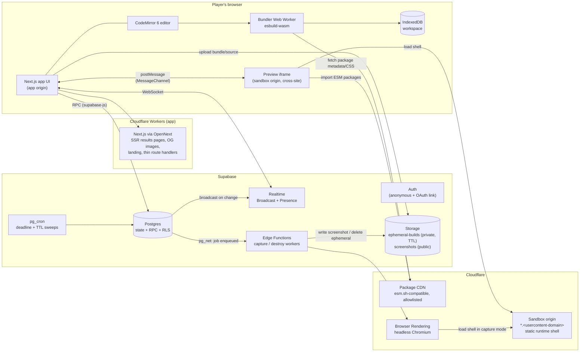
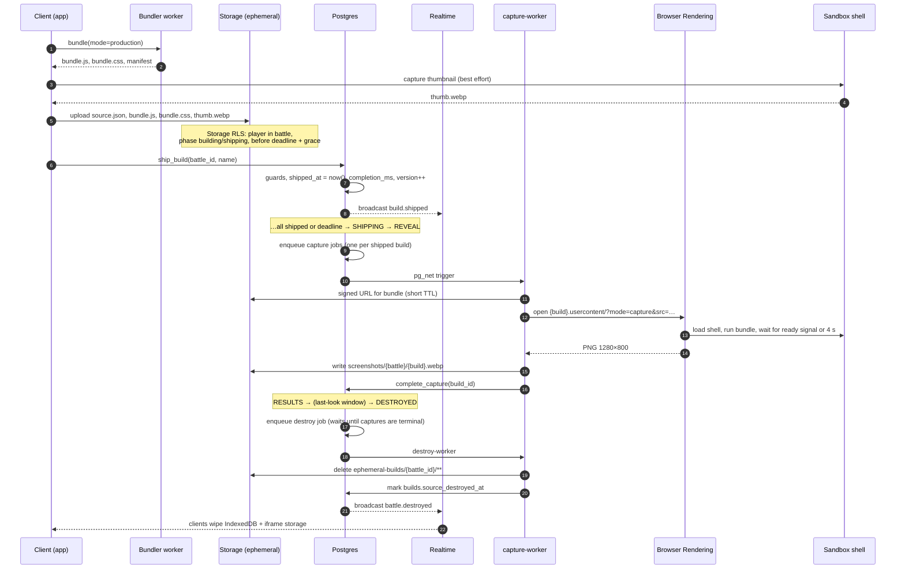

# 1. Production architecture

## 1.1 Principles

These decide most of the trade-offs below.

1. **Builds are temporary, results are permanent.** Source code and bundles go only into
   ephemeral storage that has a hard TTL. Permanent storage only holds metadata and images.
2. **Postgres is the truth, Realtime is a doorbell.** All game state lives in Postgres rows
   and changes only through transactional RPCs. Realtime messages only tell clients that
   something changed. A client that misses messages can always rebuild its view from one fetch.
3. **Untrusted code never runs on an origin we care about.** User builds run only on a
   separate registrable domain, in sandboxed iframes, and never on the app origin.
4. **The player's device does the heavy work.** Bundling and live preview run in the
   browser, so the CPU cost grows with players' devices instead of our servers. The only
   server-side execution of user code is the screenshot capture, which runs on an isolated
   managed browser.
5. **No servers we run ourselves in v1.** Supabase and Cloudflare, nothing else. No
   game server process, no WebSocket fleet, no Kubernetes. Timers are enforced from data,
   not by in-memory loops.
6. **Zero-setup onboarding.** Open a link, type a name, play. Auth is anonymous by default
   and can be upgraded to a real account later.

## 1.2 System diagram



## 1.3 Components

### Web app: Next.js on Cloudflare Workers
Deployed with the OpenNext Cloudflare adapter (`@opennextjs/cloudflare`), so the app, the
sandbox shell, the package-CDN cache and screenshot rendering all live in one Cloudflare
account. M2 starts with a spike that checks Next 16 compatibility. If it fails, the fallback
is a plain Node `next start` on Fly.io (option B).

**Spike result (T-012): GO with caveats.** Next 16.3.8 runs under `@opennextjs/cloudflare`
1.20.8, and the full web e2e suite passes against the local Workers preview. The Worker bundle
is 829 KiB gzip; the limit is 10 MB on Workers Paid. `esbuild.wasm` (13.3 MiB) is served as a
static asset, which allows up to 25 MiB per file. Rules that follow from the spike:
- use **Workers Paid**, because the free plan's 10 ms CPU and 3 MB size limits are too tight;
- avoid `proxy.ts` (middleware) unless it's really needed, since it adds about 1.2 MB gzip;
- results pages (`/battles/[id]`) use the **R2 incremental cache** for ISR. Static pages use
  the static-assets cache. (T-026: everything cached is in R2 now, with a D1 tag cache and a
  Durable Object revalidation queue; see "Caching of the permanent pages" below);
- set `metadataBase` for OG images. `next/og` works, but T-033 dropped it: a card drawn per
  request cost about 300 ms of CPU (docs/08-free-tier.md §1).
- Deploy with `cf:deploy`, never with plain `wrangler deploy`. See `apps/web/DEPLOY.md`.
| Route | Rendering | Purpose |
|---|---|---|
| `/` | static + client | Landing page, "Create room", "Join with code" |
| `/r/[code]` | static + client-heavy | Room: lobby, spin, build workspace, reveal, vote, results. One prerendered page for every room (a rewrite to `/r`; the code is read in the browser, T-033) |
| `/battles/[id]` | SSR + ISR | Permanent results page (shareable). Reads only persisted data. Its `og:image` is the winning screenshot (Supabase Storage) or the static `/og-card.png`; no card is drawn per request (T-033) |
| `/u/[id]` | SSR, cached data | Player history (builds, awards) |

**Caching of the permanent pages (T-026).** `/battles/[id]` (with its `og:image`) is cached
for an hour once the battle is DESTROYED with `destroyed_at` set (nothing changes by itself
after that), and for seconds before that (screenshots land, then the destroy job) or while
the battle is not public yet. `/u/[id]` renders per request from data at most a minute old.
A takedown in `/admin` revalidates the battle's page (and so its `og:image`) and every history page
that lists it at once (cache tag `battle:{id}`). The rules are in
`apps/web/src/lib/cache/policy.ts`, the Cloudflare setup in `apps/web/DEPLOY.md`
("Caching").

Server code in Next.js stays thin. Game logic lives in Postgres functions so there's a
single transactional authority. Route handlers are only for things that need a secret the
browser can't hold, such as Turnstile verification before anonymous sign-up, or admin and
moderation actions.

### Supabase
- **Auth:** anonymous sign-ins, protected by Cloudflare Turnstile. A player can link GitHub
  or Google later to claim their history across devices.
- **Postgres:** all game state. Every mutation goes through `SECURITY DEFINER` RPCs that
  check guards, take row locks, bump a `version` and append to `battle_events`.
  Clients have no direct INSERT/UPDATE/DELETE rights. See [05-database](05-database.md).
- **Realtime:**
  - **Broadcast**, on private channel `battle:{id}`, is fired from Postgres triggers
    (`realtime.send` / `realtime.broadcast_changes`) when a battle, player or build row
    changes. The payload is `{type, version}` plus small fields. Clients refetch if they
    detect a gap.
  - **Presence**, on the same channel, carries online status and ephemeral "activity
    pulses" (typing, last build OK/failed, line count). None of this is persisted.
  - Broadcast is preferred over Postgres Changes because it scales better (no per-subscriber
    RLS evaluation per change) and lets us decide the payload shape ourselves.
- **Storage:**
  - `ephemeral-builds` is a private bucket. Path: `{battle_id}/{user_id}/{file}`. It holds
    `source.json`, `bundle.js`, `bundle.css`, `autosave/*` and `thumb.webp`. Every object is
    deleted by DESTROY, and a hard TTL sweep removes anything older than 24 h.
  - `screenshots` is a public bucket with unguessable paths `{battle_id}/{build_id}.webp`.
    It is written only by the service role. This is the only permanent binary data.
- **Edge Functions:** `capture-worker` and `destroy-worker` take jobs from a Postgres
  `jobs` table. They are triggered via `pg_net` when a job is enqueued, and retried by
  pg_cron.
- **pg_cron:**
  - `sweep_deadlines()` every few seconds advances any battle whose `phase_ends_at` has
    passed (this is the backstop, because clients normally nudge first).
  - `sweep_jobs()` every 30 s retries jobs.
  - `sweep_ttl()` every 10 min destroys anything past its hard TTL and orphaned objects.

### Cloudflare
- **Sandbox origin**, in two stages:
  - **Stage 1 (launch):** the shell is hosted on Cloudflare Pages at a free `*.pages.dev`
    address. `pages.dev` is already on the Public Suffix List, so the sandbox is a
    different *site* from the app with no second domain to buy. All builds share this one
    origin, so cross-build storage isolation relies on the shell's full storage wipe on
    every load and reset (T-009).
  - **Stage 2 (growth):** our own usercontent domain with wildcard DNS and TLS, one
    subdomain per build (`{build_id}.<usercontent-domain>`), and a Public Suffix List entry
    so every build is its own site (security finding F1).
- **Package CDN:** `@br/pkg-cdn` (`apps/pkg-cdn`, built in T-006) is our own service with
  esm.sh-compatible URLs, backed directly by the npm registry. It:
  - verifies tarball integrity (sha512) and extracts tarballs safely;
  - bundles each package to ESM with esbuild and never runs package code;
  - enforces a denylist and size and time limits;
  - writes immutable outputs to a disk cache.

  It is a Node service (native esbuild + filesystem), so it can't run as a Cloudflare
  Worker. It runs in **Cloudflare Containers** (decided with option A) **behind the
  Cloudflare cache**. Exact-version URLs are immutable, so the edge
  serves almost every request and the origin only bundles cold packages. This replaces the
  earlier "proxy esm.sh, then self-host esm.sh" plan.
- **Browser Rendering:** headless Chromium that is called from a Worker. It loads the
  sandbox shell in capture mode for a frozen bundle and returns a PNG. User code therefore
  runs on Cloudflare's isolated browser fleet and not on anything we run. Browserless is an
  equivalent fallback vendor.

### Observability
- Sentry for the app, the bundler worker and Edge Functions. Errors from the runtime shell
  are **user code errors**, so they are counted and shown to the player but not sent to Sentry.
- PostHog for the product funnel (link opened → joined → shipped → voted → rematch) and
  sandbox metrics (cold start, rebuild latency, package failures).
- `battle_events` is an append-only log of every transition, so stuck battles can be
  debugged and timelines replayed.

## 1.4 What runs where

This is the most important boundary in the system. Anything in the left column is
untrusted. The client can lie, so the server never trusts client-reported times,
results or votes.

| Concern | Client (app origin) | Server (Supabase / Cloudflare) | Sandbox (usercontent origin) |
|---|---|---|---|
| **Identity** | Holds the Supabase session JWT | Issues anonymous/OAuth sessions, enforces RLS | No identity. It never sees the JWT or any cookie for the app. |
| **Game state** | Renders state, predicts countdowns from server timestamps, sends intents via RPC | **Authoritative.** Phase transitions, guards, deadlines, versioning, event log | — |
| **Timers** | Shows countdown using `phase_ends_at` and the measured clock offset. Nudges `advance_battle` when the deadline passes. | Enforces deadlines in RPC guards (`now()` checks) and via the pg_cron sweep | — |
| **Challenge spin** | Plays the spin animation, which lands on the server's result | Picks the cards (weighted random, server-side), writes the `challenges` row | — |
| **Editing** | CodeMirror, file tree, templates, paste-import | — | — |
| **Workspace persistence** | IndexedDB (primary copy, survives refresh) | Autosave copy in `ephemeral-builds` every ~30 s (survives device loss) | — |
| **Bundling** | esbuild-wasm in a Web Worker: TS/JSX → ESM, CSS bundling, rewriting npm imports to CDN URLs | — | — |
| **npm packages** | Resolves versions, pins them in the workspace manifest | Package CDN serves ESM and enforces the allowlist | Imports packages from the CDN via the import map |
| **Executing user code** | **Never** | Only in Browser Rendering for screenshots (isolated, vendor-managed) | **Always.** Runs the bundle, captures console and errors, sends heartbeats |
| **Ship** | Builds the final bundle, uploads the artifacts, calls `ship_build` | Storage RLS allows uploads only before the deadline. `ship_build` checks phase, deadline and that the objects exist, then stamps `shipped_at` with `now()` | — |
| **Reveal** | Fetches other players' bundles (RLS: battle members only, reveal phase or later) and hands them to the iframe | Controls the spotlight (`reveal_index`) and the reveal order | Runs other players' builds in a fresh origin with storage wiped first |
| **Voting** | Ballot UI | `cast_vote` checks eligibility (no self-votes, one per category). Tallies and awards are computed server-side. | — |
| **Screenshots** | Takes a best-effort client thumbnail at ship time (fallback only) | Capture job → headless render of the frozen bundle → `screenshots` bucket | Capture mode signals "ready" so the render waits for it |
| **Destroy** | Clears its IndexedDB workspace and tells iframes to wipe their storage | Deletes the `ephemeral-builds/{battle_id}/` prefix and stamps `source_destroyed_at`. The TTL sweep is the safety net. | Wipes `localStorage`/IndexedDB on a `reset` message and on every fresh load |
| **Moderation** | Report button, host kick | Report queue, takedown (deletes the screenshot), rate limits | — |

## 1.5 Key flows

### Join (zero setup)
1. A player opens `https://<app>/r/K7QXM`.
2. If there's no session, the app calls `signInAnonymously()` (with a Turnstile token).
3. The page asks for a display name only, prefilled with a random fun name.
4. `join_room(code, display_name)` runs. The player joins the `battle:{id}` / `room:{id}`
   channel and tracks presence.
5. The page fetches the room snapshot and renders the lobby. Time from link to lobby
   should be under 3 s.

While the player is in the lobby, the app preloads the editor chunk, esbuild-wasm and the
React template packages in the background. That way BUILD starts instantly.

### Ship → capture → destroy



## 1.6 Major decisions

| Decision | Choice | Rejected alternatives and why |
|---|---|---|
| Sandbox runtime | Custom: esbuild-wasm worker + ESM CDN + cross-site iframe, behind a `SandboxRuntime` interface | **WebContainers**: needs a commercial license for for-profit production use, needs COOP/COEP cross-origin isolation (which complicates the whole app), boots slower, uses more memory, and has limited Safari/mobile support. v1 is frontend-only, so we don't need Node in the browser. We keep it as a future "full-stack mode" runtime. **Sandpack**: a good shortcut for a prototype, but its preview and bundler live on a third-party origin. We want control over the shell (heartbeat, capture mode, storage wipe), package policy and costs. See [03-sandbox](03-sandbox.md). |
| Editor | CodeMirror 6 | **Monaco**: better TypeScript IntelliSense, but a much heavier download, weak on mobile and harder to theme. Vibe coders paste more than they type. CM6 plus an optional TS language-service worker is enough. |
| Game authority | Postgres RPCs with a version CAS | **A Node game server**: an always-on process we would have to scale and keep available. **Next.js API routes**: no transactional gain, and adds an extra hop. |
| Realtime | Broadcast from DB triggers + Presence | **Postgres Changes**: RLS is evaluated per subscriber per change and doesn't scale as well. **Self-hosted WebSockets**: we'd have to operate them. |
| Timers | Server timestamps + lazy client nudges + pg_cron backstop | **Server `setTimeout`**: we have no persistent server, and it gets lost on deploy. |
| Canonical screenshot | Server-side headless render of the frozen bundle | **Client-only capture**: lower fidelity (DOM-to-canvas misses WebGL, fonts and filters) and can be forged. Clients could upload a fake screenshot as their permanent result. We keep the client thumbnail as a fallback. |
| App hosting | Cloudflare Workers via OpenNext (option A, user decision 2026-10-04) | **Vercel**: one more vendor and account, and the user prefers not to use it. **Fly.io (Node)**: the fallback if OpenNext can't run Next 16. |
| Auth | Supabase anonymous, linkable later | **Required sign-up**: kills the "open link, play" moment. |

## 1.7 Cost model (rough estimates; validate in M5)

Assume a battle has 6 players and a 10-minute build.

| Item | Per battle | Notes |
|---|---|---|
| Bundling and preview | $0 | Runs on players' devices |
| Ephemeral storage | ~6 × (≤1 MB source + ≤3 MB bundle), for at most hours | Deleted at DESTROY. Roughly zero storage-month cost. |
| Egress for reveal | ~6 viewers × 6 bundles × ~0.5 MB ≈ 18 MB | The largest variable cost. Packages are cached by the CDN. |
| Screenshot renders | 6 × ~5 s of headless browser time | Cents per battle at most |
| Permanent screenshots | 6 × ~150 KB WebP | ~1 MB per battle, forever. Use Supabase image transforms for thumbnails. |
| Realtime | ~6 connections × ~15 min plus a few hundred messages | Activity pulses are throttled to ≤1 per 2 s per player |
| Postgres | A few hundred small writes | Negligible |

Fixed baseline: Supabase (free tier to start, Pro at launch), Cloudflare Workers Paid (needed for Containers and Browser Rendering), plus one domain for the app. The main
things that drive costs up are Realtime concurrent connections and messages (plan limits),
reveal egress, and Browser Rendering minutes. We watch all three from day one.

## 1.8 Proposed repository layout

```
apps/
  web/                 Next.js app (UI, routes, OG images)
  sandbox-shell/       Static runtime shell deployed to the usercontent domain (versioned paths)
  capture-worker/      Cloudflare Worker wrapping Browser Rendering (called by the Edge Function)
packages/
  runtime/             SandboxRuntime interface + esbuild-wasm implementation (worker code)
  protocol/            Typed postMessage protocol shared by web ↔ shell (zod schemas, versioned)
  game/                Shared types and pure helpers: phase metadata, countdown math, vote rules
  templates/           Starter workspaces (React+CSS, React+Tailwind, Canvas game, SVG art)
supabase/
  migrations/          SQL DDL, RLS, RPCs, triggers, cron
  functions/           Edge Functions: capture-worker, destroy-worker
  tests/               pgTAP tests for RPC guards and transitions
e2e/                   Playwright multi-context battle tests
docs/                  These design docs
```

pnpm workspaces + Turborepo. The rules of the state machine live **only** in SQL. The
`packages/game` package mirrors the read-side metadata (phase names and durations) for UI
and never decides transitions.
