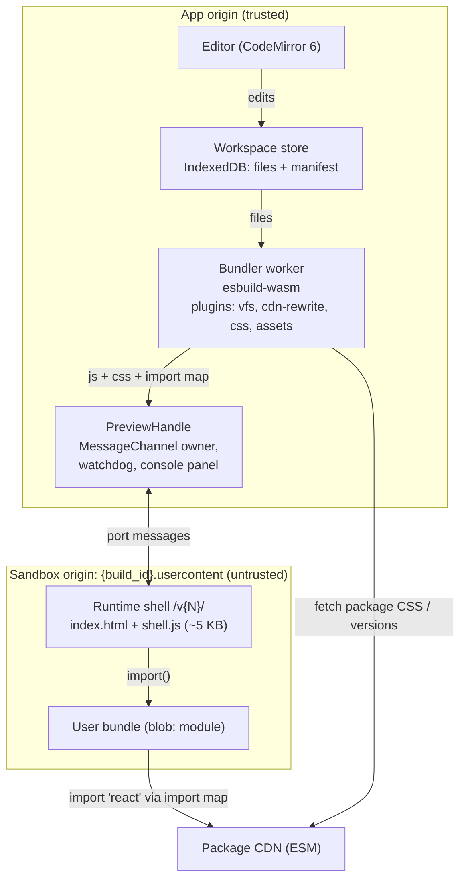
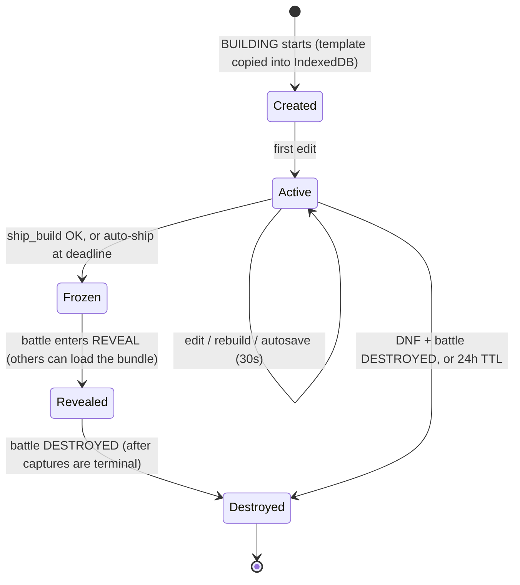

# 3. Disposable sandbox architecture

## 3.1 Requirements

**v1 must support:** React, TypeScript/TSX, CSS (plain, modules and package CSS), browser
APIs (Canvas, SVG, WebAudio, WebGL, `localStorage`, `fetch` to public APIs without keys),
frontend npm packages, and a live preview that updates in under a second.

**Out of scope for v1:** backend servers, Docker, a shell, databases, secrets, native
binaries, Node built-ins.

**Non-functional:** zero setup. Cold start under 3 s after the lobby preload. Rebuild
under 300 ms. Safe for *viewers* as well as builders. Every copy is destroyable.

## 3.2 Runtime choice

| Option | Pros | Cons | Verdict |
|---|---|---|---|
| **WebContainers** | Real Node, `npm install`, Vite and dev servers. Could support backends later. | Commercial license required for for-profit production use. Requires COOP/COEP cross-origin isolation, which constrains the whole app (third-party embeds, OAuth popups). Heavier boot and memory. Limited Safari/mobile support. Overkill when we have no backend. | Not for v1. Keep for a later "full-stack mode". |
| **Sandpack (hosted)** | Very fast to integrate, mature | Preview and bundler on a third-party origin, so we have less control over capture mode, storage wipe, heartbeat and package policy. Vendor dependency for a core feature. | Acceptable for a throwaway prototype only |
| **Custom: esbuild-wasm + ESM CDN + cross-site iframe** | Light, no license, works in every modern browser, full control of security and capture, no isolation headers needed | We have to build and maintain it, about 1.5k–3k lines | **Chosen** |

We hide the choice behind an interface so WebContainers (or anything else) can be added
later without touching game code:

```ts
interface SandboxRuntime {
  readonly kind: 'esm-browser' | 'webcontainer';
  boot(opts: { template: TemplateId; files?: FileMap }): Promise<void>;
  writeFile(path: string, contents: string): void;      // triggers debounced rebuild
  build(mode: 'dev' | 'production'): Promise<BuildResult>; // { js, css, manifest, diagnostics }
  attachPreview(frame: HTMLIFrameElement, buildId: string): PreviewHandle;
  exportSnapshot(): Promise<WorkspaceSnapshot>;          // source.json for ship/autosave
  destroy(): Promise<void>;                              // wipe IndexedDB + terminate worker
}
```

## 3.3 Components



### Workspace model
```jsonc
// manifest (stored with the files)
{
  "template": "react-ts",
  "entry": "src/main.tsx",
  "dependencies": { "react": "18.3.1", "react-dom": "18.3.1", "zustand": "4.5.2" },
  "tailwind": false
}
```
- The file tree is limited to: 50 files, 1 MB total source, 256 KB per file. Text only.
  Small images are allowed as files of ≤200 KB each, imported as data URLs.
- Templates: `react-ts` (default), `react-tailwind`, `canvas-game`, `svg-art`, `vanilla-ts`.
- Dependencies are added by typing an import (auto-detected, with an "Add `zustand`?"
  chip) or through a package search box. Versions are resolved once and pinned in the
  manifest, which makes the build reproducible for capture and reveal.
- **Paste-import:** paste a single big blob from an AI chat with
  `// file: src/App.tsx` markers and it becomes multiple files. This matters a lot for
  vibe coders.

## 3.4 Build pipeline

1. **Edit**, debounced by 150 ms, then the worker gets `{files, manifest}`.
2. esbuild-wasm runs `build()` with `format: 'esm'`, `bundle: true`, `jsx: 'automatic'`,
   `define: { 'process.env.NODE_ENV': '"development"' }`. In production mode it also
   minifies.
3. Plugins:
   - **`vfs`** resolves relative imports against the in-memory file map.
   - **`cdn-rewrite`** marks bare imports (`zustand`, `three/examples/jsm/...`) as
     `external` and rewrites them to `https://pkg.<cdn>/zustand@4.5.2?external=react,react-dom`
     (subpaths are kept). Since T-040 the list holds every other package of the manifest, and
     the import map maps each one, so a package another package imports is one instance (see
     "One instance per package" below). React itself stays bare and is resolved by the
     shell's import map.
   - **`css`** bundles local CSS imports into `bundle.css`. Package CSS is fetched from the
     CDN, cached in the worker and inlined. CSS modules are supported through esbuild's
     `local-css` loader.
   - **`assets`** turns images into data URLs.
   - **`tailwind`** (optional template): the shell loads the Tailwind browser runtime, so
     there's no build step.
4. The output is `{ js, css, importMap, diagnostics }`. Diagnostics go to the editor
   gutter and problems panel.
5. TypeScript **type checking is not on the hot path**. esbuild strips types. An optional
   TS language-service worker (M6) adds squiggles without blocking the preview.

## 3.5 Preview isolation

```html
<iframe
  src="https://{build_id}.buildroulette-usercontent.net/v3/"
  sandbox="allow-scripts allow-same-origin allow-forms allow-modals allow-pointer-lock allow-popups"
  allow="autoplay; fullscreen; gamepad; clipboard-write"
  referrerpolicy="no-referrer"
  loading="eager">
</iframe>
```

- **Why `allow-same-origin` is safe here:** the iframe's origin is a *different site*
  from the app. Same-origin only gives the build its own origin, which `localStorage` and
  IndexedDB need. Without it the origin is opaque and `localStorage` throws. Do **not**
  add: `allow-top-navigation*`, `allow-popups-to-escape-sandbox`, `allow-downloads`.
- **Per-build subdomain** keeps builds from reading each other's `localStorage`.
- **Shell response headers:**
  - `Content-Security-Policy: default-src 'none'; script-src 'self' 'unsafe-inline' 'unsafe-eval' blob: https://pkg.<cdn> https://<tailwind-runtime-host>; style-src 'self' 'unsafe-inline' blob: https:; img-src * data: blob:; font-src * data:; media-src * data: blob:; connect-src https: wss:; worker-src blob:; frame-ancestors https://<app-domain>`
  - `connect-src https:` is a deliberate v1 choice so builds can call public APIs (for
    example PokéAPI or Open-Meteo). The sandbox holds no secrets, so there is nothing
    of ours to exfiltrate.
  - `frame-ancestors` blocks other sites from embedding our sandbox shell.
  - `Permissions-Policy: camera=(), microphone=(), geolocation=(), payment=(), usb=(), serial=(), hid=()`
  - `Cross-Origin-Resource-Policy: same-site`, `Referrer-Policy: no-referrer`
  - **Why `'unsafe-eval'`** (T-006/T-007): libraries such as pixi.js v8 compile code with
    `new Function` at runtime. A build is arbitrary JavaScript already, so allowing eval
    doesn't widen what a build can do. Compatibility went from 52/55 to 54/55.
  - **Why `'unsafe-inline'` in `script-src`** (found in T-003): Chromium applies
    `script-src` to inline `<script type="importmap">`. The import map depends on each
    build's pinned React version, so a static host can't use a hash or a nonce. This
    doesn't widen what a build can do, because a build is arbitrary JavaScript loaded
    from `blob:` already.
- **Fresh document per load** (T-003): each `load` creates a new same-origin child iframe
  inside the shell (`document.write` of a standards-mode skeleton, then the import map,
  styles and a `blob:` module). Removing the old frame kills every timer and global the
  previous build left behind. `document.open()` on the shell's own page doesn't, because it
  keeps the same window.
- **Shell versioning:** the shell lives at immutable paths (`/v3/`). The protocol version
  is negotiated in the handshake.

### Bridge protocol (packages/protocol)
1. The shell loads and posts `{type: 'hello', protocol: 3}` to `parent` with target origin
   = app origin.
2. The app checks `event.origin` against `https://{build_id}.<usercontent>` and checks that
   `event.source` is that exact iframe's `contentWindow`. It then transfers a
   `MessageChannel` port along with a random nonce. From then on all traffic uses the port.

| Direction | Message | Purpose |
|---|---|---|
| app → shell | `load {js, css, importMap, mode: 'live'|'reveal'|'capture', packages?}` | Run a bundle (the shell does a full document reset, then a fresh `import()` of a blob URL). `packages` (T-032) lists the CDN URLs the bundle imports, a hint for naming a package that can't load |
| app → shell | `reset-storage` | Wipe `localStorage`, `sessionStorage`, IndexedDB and caches for this origin |
| app → shell | `capture-thumbnail {width, height}` | Best-effort client thumbnail |
| app → shell | `ping` | Watchdog probe |
| shell → app | `ready`, `heartbeat` | Liveness and capture readiness |
| shell → app | `console {level, args}` (throttled, size-capped) | Console panel |
| shell → app | `runtime-error {message, stack}` | Error overlay; maps back to source with sourcemaps |
| shell → app | `thumbnail {webp}` | Fallback screenshot |

Every message is validated with zod on receipt. Unknown or invalid messages are dropped.

### Hot reload
For v1, every rebuild does a **full reload of the iframe document**: the shell clears the
document and imports the new blob. This is simple and robust, and `localStorage`
persists across reloads within a build. React Fast Refresh is a possible later
enhancement.

### Watchdog
The shell sends a heartbeat every 1 s from the main thread. If heartbeats stop for 5 s
(for example because of an infinite loop), the PreviewHandle removes the iframe, shows
"Build froze", and offers "Restart preview". When building, the player's own preview
also gets a **safe-mode restart**: the next load runs with `requestAnimationFrame` and
timers paused until the user clicks, so a loop that runs on load can't freeze the page
repeatedly.

As built: liveness is a `ping`/`pong` round trip (T-009), a load gets a 15 s grace
(T-027), and since T-031 every limit counts app-awake time only, so a starved app page
doesn't report its own stall as a frozen build. See "Watchdog load grace" and "Watchdog
under starvation" below.

## 3.6 Workspace lifecycle



| Copy | Location | Created | Destroyed by |
|---|---|---|---|
| Working files | Builder's IndexedDB (app origin) | BUILDING start | Client on `battle.destroyed`, or on next app load (stale-workspace cleanup by battle id) |
| Autosave (source + last good bundle) | `ephemeral-builds/{battle}/{uid}/autosave/` | Every 30 s | destroy-worker prefix delete, TTL sweep |
| Shipped artifacts | `ephemeral-builds/{battle}/{uid}/{source.json, bundle.js, bundle.css, thumb.webp}` | Ship | destroy-worker prefix delete, TTL sweep |
| In-memory bundle | Viewers' tabs during reveal | REVEAL | Tab navigation, `battle.destroyed` message |
| Sandbox-origin storage | Each viewer's `{build_id}.usercontent` origin | When the build runs | `reset-storage` on every fresh load and on destroy |
| Capture session | Browser Rendering | Capture job | Session closed after each capture |

**Persisted forever:** only the screenshot WebP plus rows in Postgres (challenge, builder,
name, completion time, stats, awards, rank). The `stats` column holds non-code facts such
as `{files, lines, deps: ["zustand","three"], bundle_bytes, rebuilds}`, so results can say
"made with three.js" without keeping any code.

## 3.7 Capture mode

Browser Rendering opens
`https://{build_id}.usercontent/v3/?mode=capture&src=<signed-url>&sig=<hmac>`.
In capture mode, the shell:
- runs only when the `sig` is valid (an HMAC from the capture-worker, so random people
  can't use capture mode to render arbitrary URLs);
- fetches the bundle from the signed URL, which is short-lived and uncached;
- does not seed or stub `Math.random` or timers, so builds are captured as they really
  behave. Fonts are preloaded and the viewport is 1280×800 at DPR 1;
- reports `ready` on `window.buildRoulette.ready()`, or on network idle + 2 s (6 s cap).

The capture-worker then takes a PNG, converts it to WebP and stores it. Thumbnails come
from Supabase image transformations at read time.

## 3.8 Performance budgets

| Metric | Budget |
|---|---|
| esbuild-wasm + shell + React template preloaded during the lobby | Before the spin ends |
| First preview after BUILDING starts | < 1 s (preloaded), < 3 s cold |
| Rebuild + preview refresh (10 files) | < 300 ms p50, < 800 ms p95 |
| Ship (bundle + upload + RPC) | < 3 s p95 |
| Reveal: switch spotlight to next build | < 1 s (prefetch the next bundle) |

## 3.9 Threat model

| Threat | Vector | Mitigation |
|---|---|---|
| Steal viewer's session | Build reads app cookies or storage | Different registrable domain. The JWT never enters the sandbox, and the app never sends it over the port. |
| Tamper with app UI | Build accesses `parent.document` | Cross-origin, so the browser blocks it |
| Fake app messages | Build posts `ship` or `vote` messages to parent | The app doesn't take actions from shell messages. They are display-only (console, errors, liveness). Port and nonce checks plus schema validation. |
| Read other builds' data | Shared `localStorage` | Per-build subdomain plus a wipe on every load |
| Phishing | Fake "log in" form during reveal | App chrome labels the frame as a user build. Players have no password to type (anonymous/OAuth). Report button. |
| Navigate the viewer away | `top.location = ...` | No `allow-top-navigation` |
| Popup spam | `window.open` loops | Popups stay sandboxed (no escape). Browser popup blocking requires user activation. |
| Freeze or crash tab | Infinite loop, memory bomb | Heartbeat watchdog, one live iframe at a time, Chromium site isolation on desktop |
| Crypto mining | Long-running CPU | Only the spotlighted build runs. Reveal slots are time-boxed. Report button. |
| Hardware access | Camera, mic, geolocation, USB | Permissions-Policy plus `allow=` denylist |
| Abuse capture mode | Use our renderer as an open proxy | HMAC-signed capture URLs. The capture-worker only renders our own shell. |
| Exfiltrate our secrets | Sandbox calls our APIs | The sandbox has no credentials. Supabase RLS denies the anonymous key on everything relevant. |
| Malicious npm package | Supply-chain code in a dependency | Same isolation as user code. Pinned versions. A CDN denylist for known-bad packages: `@br/pkg-cdn`'s; on the public esm.sh (free plan, T-035) only esm.sh's own policy applies, see "The package CDN" below. |
| Embed the shell elsewhere | Third-party site frames our shell | `frame-ancestors` is limited to the app origin |

### Review findings (T-008, code review; fixes tracked as T-009/T-010)

**Design rule: treat the shell as hostile.** The build's frame is same-origin with the
shell, so a build can run code in the shell's realm, use its port, and start a new
handshake. Every message from the sandbox is therefore *display-only and untrusted*:
console, errors, `ready`, `heartbeat` and `storage-reset`. Nothing that matters may
depend on them. In particular:
- capture readiness (M2) is decided by the capture worker, with a fixed wait and a cap.
  A shell `ready` is only a hint;
- destroy never relies on a `storage-reset` acknowledgement;
- once connected, the app ignores a repeated `hello` unless it started the reload itself.

| Threat | Vector | Mitigation |
|---|---|---|
| Builds are same-site with each other | `{build_id}.usercontent` subdomains share a registrable domain, so `Domain=` cookies are shared, a "cookie bomb" can break every preview, and `document.domain` works in some browsers | Add the usercontent apex to the **Public Suffix List** before launch (needs the domain; blocked on the user). Send `Origin-Agent-Cluster: ?1`. |
| Shell-realm persistence | The build installs timers or prototype patches on `parent`, which survive a frame teardown | A real restart recreates the whole preview iframe (new `PreviewHandle`). In production every build has its own shell iframe anyway. |
| App-side flood through the bridge | A hijacked port sends unlimited console messages and the app re-renders on each | Rate-limit and cap in `PreviewHandle`; batch UI updates per animation frame |
| Watchdog spoofing | The port is moved to a worker that keeps sending heartbeats while the main thread loops | Liveness pings must be answered from the main thread. Inherently best-effort; the app stays responsive thanks to site isolation. |
| Incomplete storage wipe | Cookies with other paths or domains, OPFS, Storage Buckets | Use `Clear-Site-Data` from a shell endpoint, plus OPFS and bucket removal |
| Popups outlive the build | `allow-popups` windows keep running and can phish outside the app chrome | No `allow-popups` and no `clipboard-write` in `reveal`/`capture` modes. They are allowed only while building your own app. |
| Headers on other paths | 404s or other paths on the sandbox host have no CSP | Apply the headers to every path. Add `base-uri 'none'`, `form-action` and a fuller Permissions-Policy. |
| Package CDN availability | Big packuments or tarballs, parallel downloads, a disk cache that never evicts | Global limits on downloads and extraction, streaming extraction, a disk quota/LRU, edge rate limits |

### Mitigation status (T-009, T-010)

| Finding | Status | Verified by |
|---|---|---|
| F1: builds are same-site | **Open**. Needs the Public Suffix List entry (user action). Meanwhile `Origin-Agent-Cluster: ?1` is sent. Until the PSL entry exists, `Clear-Site-Data: "cookies"` clears cookies for the whole usercontent domain. | — |
| F2: re-handshake through the shell realm | Mitigated. One `hello` is accepted per navigation the app starts (attach, mode switch, reset, `restart()`); later ones are ignored and counted. | Unit tests with fake windows |
| F3: shell-realm persistence | Mitigated. `resetStorage()`, a mode switch and `restart()` all replace the whole preview iframe. | Unit + e2e (old element is gone) |
| F4: flood through the bridge | Mitigated. Per-type budgets in `PreviewHandle` (console 100/s, errors 20/s, ready 10/s and only for the current load); retained console capped at 200K chars / 500 entries; web UI batched per animation frame. | Unit tests: 10,000 messages → 1 render |
| F5: package CDN availability | Mitigated (T-010). Global limiters with load shedding, cancellation, streaming extraction, disk quota + LRU. | 118 unit tests incl. gzip bombs |
| F6/F7: incomplete storage wipe | Mitigated. Cookies on every path, domain, `Partitioned` and Cookie Store variant; OPFS, Storage Buckets, service workers; `/v1/reset` with `Clear-Site-Data`; reset and load serialized. | e2e: every store empty after reset |
| F8: watchdog spoofing | Partly mitigated. `ping {seq}` / `pong {seq}` answered from a main-thread `setTimeout(0)`; heartbeats no longer count as liveness. Code in the shell realm could still answer from a worker (best-effort, documented). | Fake-timer unit tests + watchdog e2e |
| F9: popups outlive the build | Mitigated. `reveal`/`capture` have no `allow-popups`, `allow-modals` or `clipboard-write`. Flags are set before navigation, and a mode switch means a new iframe. | e2e: `window.open` → null, clipboard rejected |
| I1/I2: headers on other paths | Mitigated. Headers on `/*` including 404s. Adds `Origin-Agent-Cluster`, `base-uri 'none'`, `form-action 'none'` and the extended Permissions-Policy (`bluetooth` left out because Chromium 141 doesn't recognise it). | Unit + e2e, no "Unrecognized feature" warning |
| I3: encoded dot segments | Fixed. `parseBareSpecifier` rejects `%2e`, `%2f`, `%5c`, `%25` and `\`. | Unit tests |
| Service worker registration | Verified blocked: blob URLs are rejected, and the CSP blocks same-origin scripts. | e2e |
| CSP inheritance into the build frame | Verified: a foreign `<script src>` is blocked in the build frame. | e2e |

**Current CSP** (supersedes the §3.5 snippet): `default-src 'none'; script-src 'self' 'unsafe-inline' 'unsafe-eval' blob: <cdn>; style-src 'self' 'unsafe-inline' blob: https:; img-src * data: blob:; font-src * data:; media-src * data: blob:; connect-src 'self' https: wss:; worker-src blob:; base-uri 'none'; form-action 'none'; frame-ancestors <app>`.

**Browser caveat:** only Chromium has been tested. Firefox ignores the `Permissions-Policy` header (the iframe `allow` list still works). Storage Buckets and `Origin-Agent-Cluster` are Chromium-only. Safari supports `Clear-Site-Data` only partly.

### Capture mode as implemented (T-013; supersedes the §3.7 URL shape)

- **URL:** `GET /v1/capture?css=&exp=&map=&src=&sig=`. The HMAC-SHA256 covers
  `br-capture-v1\n<host>\n<path>\n<sorted query without sig>`. `exp` must be at most
  10 minutes ahead. Unknown or repeated parameters are refused. `map` is the import map as
  JSON and is part of the signature.
- **The secret never reaches public JS.** A server-side **capture gate** checks the
  signature: in production it's a Cloudflare Pages `_worker.js` routed only to
  `/v1/capture`, with the secret stored as a Pages secret; locally the shell's dev server
  runs the same check. Requests failing the check get an empty 403. Because the gate runs
  on the server, nobody can open `/v1/capture?src=<anything>` and get top-level JS on our
  origin.
- **The capture page:** wipes origin storage, then fetches the bundle `no-store`,
  credential-free and with no redirects. It runs the build in a fresh 1280×800 frame. Its
  headers are `frame-ancestors 'none'` and a CSP `sandbox` with the same flags as the
  `capture` run mode.
- **Readiness is decided by the renderer:** the build calls
  `window.buildRoulette.ready()`, *or* the network has been idle for 2 s, with a 6 s cap
  either way. A forged signal can only make the capture earlier.
- **Renderer:** `PlaywrightRenderer` in the self-hosted worker. It allows navigation only to
  the exact capture URL (other navigations get a 204), closes popups, dismisses dialogs and
  enforces a hard timeout. The output is a WebP via sharp. Production on the free plan
  renders through Browser Rendering's REST API instead (T-034, next section); the
  "Worker with a browser binding" plan was dropped (Workers Free's 10 ms CPU, docs/08 §1).
- **Fallback:** if the render fails or is blank (pixel variance check), the client's
  `thumb.webp` is used and marked `fallback`. When neither exists, the result is `failed`.
- **Destroy worker:** checks the battle is destroyed or abandoned, recursively deletes
  `ephemeral-builds/{battle}/`, re-lists to confirm nothing is left, then calls
  `complete_destroy`.
- **Stage-1 domains:** with the sandbox on a single `*.pages.dev` origin, every build
  shares one capture origin. Isolation then relies on the storage wipe before each run.
  Per-build origins come with the stage-2 domain.

### Capture on the free plan: Browser Rendering's REST API (T-034)

The `jobs` Supabase Edge Function (docs/08-free-tier.md §5) captures with one
`POST …/browser-rendering/snapshot` per build. It sends the signed capture URL at 1280×800
DPR 1, `waitForSelector: html[data-br-capture]` with a **6 s** timeout plus `bestAttempt`
(this timeout **is the cap**), `actionTimeout` 10 s, and a WebP at quality 82. `/snapshot`
returns the screenshot and the page's HTML from the same session, so the capture page
reports on `<html>`:

| Attribute | Set by | Meaning |
|---|---|---|
| `data-br-capture-page` | the gate's HTML (`CAPTURE_HTML`) | the gate served the page (absent: a 403 or no page → `shell-refused`) |
| `data-br-capture="ready"` | `buildRoulette.ready()` | shoot now (the selector matches at once) |
| `data-br-capture="failed"` + `data-br-capture-error` | `capture.js` when it cannot run the build | render failure → client thumbnail |
| `data-br-paint` = `content` / `empty` | `capture.js` every 250 ms and at the ready signal (`paint.ts`) | `empty`: nothing in the build's frame paints → blank → client thumbnail |

The function cannot decode WebP (no sharp in Deno), so `data-br-paint` takes over from the
worker's pixel check. It looks for visible elements in the viewport that paint: text,
replaced elements, a background, a border, a shadow, an outline or a pseudo-element with
content. A background image on `html`/`body` also counts; a plain background colour does
not (a single flat colour is blank, as with pixels). Like the console hints, the attributes
come from a realm the build controls. That is acceptable for the same reason: a build can
only make its own capture earlier, blank or thumbnail-based.

**Compared with `PlaywrightRenderer`:**

- no "network idle + 2 s" (a build without the ready signal waits the full 6 s);
- no navigation guard (the CSP `sandbox` still blocks popups, modals and downloads);
- blank detection by DOM rather than pixels.

Locally and in tests, `apps/capture-worker/src/stand-in.ts` implements that REST subset on
`PlaywrightRenderer.session()` with the guard off, like the real service.

### Watchdog load grace (T-027)

A `load` blocks the shell's main thread for two long tasks: swapping the frame, then
evaluating the whole module graph. The build's frame shares that thread with the shell,
because they're same-origin. Under CPU contention these tasks can exceed the 5 s pong
limit, so the old watchdog reported a crash for a slow but finite load.

- **The grace window:** when the app sends `load`, `PreviewHandle` opens a 15 s window in
  which up to 15 s of silence is tolerated. `ready` for that load can only *shorten* the
  window, to 5 s after `ready`.
- **Why the sandbox can't abuse it:** only the app's own sends open or move the window, so
  the sandbox can't extend it. Total silence never exceeds 15 s (of app-awake time since
  T-031).
- **Detection bounds:**
  - a loop after `ready` is still caught in about 4–5.25 s;
  - a loop during the load (at a module's top level) is caught within about 15.25 s of the
    load. That's the accepted trade-off.
- `crash` events now carry `phase` (`connecting` | `loading` | `running`).


### Watchdog under starvation (T-031)

T-027's grace covers a load. The same false crash also happened **after** `ready`: in chaos
shard 1 (6 browsers on 4 CPUs) one player's preview reported `heartbeat-timeout
silentMs=5309 phase=running` at the start of BUILD, with no loop in the build.

- **Root cause:** silence was measured on the wall clock (`now - lastPongAt`). While the app
  page itself gets no CPU (a starved machine), or runs a long task of its own, it can neither
  send pings nor receive pongs. When it resumes, the first watchdog tick counts the app's own
  stall as the frame's silence. A real loop in a site-isolated frame doesn't delay the app's
  timers, so the two can be told apart from the app side.
- **Evidence in the failure artifacts:**
  - the crash was already on screen 6.4 s after BUILD started; that player's first build took
    2349 ms (about 150 ms normally);
  - her page's DevTools events stopped: the `building` broadcast that the other five pages
    logged at 50.38 s reached hers at 54.30 s, and four presence messages the others got one
    second apart arrived within 8 ms at 55.39 s;
  - her page sent no screencast frame for 9.5 s (two 4.8 s gaps), the longest of the six
    (the others: 1.5–2.8 s gaps).
  - So her app page's own main thread did not run for about 5 s. The crash measured that.
- **Reproduced** (`packages/runtime/e2e/watchdog-starvation.spec.ts`), both with a calm build:
  - every renderer process of the browser stopped (SIGSTOP) for 7 s, with the app page and
    the frame CPU-throttled x6: the old watchdog reported `heartbeat-timeout`, silence
    7.3 s, phase `running`;
  - both throttled pages blocked by overlapping long tasks (app 6.5 s, frame 7.5 s): silence
    6.0 s, phase `running`.
- **Fix: app-awake time.** Every watchdog limit (the 5 s heartbeat limit, the 15 s load grace,
  the 10 s handshake timeout) is measured on an **app-awake clock**. The 250 ms watchdog tick
  advances it by at most one interval plus 50 ms of timer jitter per run (a busy page runs its
  timers a few tens of ms late, which must not slow loop detection). A tick that runs later
  shows that the app's own timers were stalled, and the stall is not counted. Events between ticks (a pong, `ready`, a
  `load` send) read the clock capped the same way, so it never runs backwards. While the
  app's timers run on time, awake time equals wall-clock time, and nothing changes.
- **Bounds** (awake time; wall-clock time is longer by however long the app was stalled):
  - a loop after `ready` is caught 4.0–5.25 s after it starts, as before. Measured: 4.3–4.8 s.
    With a 3 s whole-browser stop inside the silence: 5.0–5.2 s awake, 7.1–7.5 s wall;
  - a loop during the load is caught within 15.25 s of the send (T-027's bound);
  - a handshake is given up after 10 s;
  - **hidden tabs are unchanged:** no check while hidden, and a fresh 5 s when the tab
    becomes visible. Hidden time is neither awake time nor a stall;
  - any stall of the app's own timers is tolerated, however long. A build that doesn't answer
    for 5 s while the app *is* awake is still a crash, because that's indistinguishable from
    a loop (for example, a frame that is far more starved than the app);
  - under continuous starvation each late tick counts 300 ms only. If every tick runs 1.25 s
    late (one tick per 1.5 s), 5 s of awake time is 25 s of wall-clock time. A real loop is
    caught that much later. That's accepted: the tab itself is that slow meanwhile.
- **Trust:** only the app's own timers advance the clock; nothing the sandbox sends does. A
  build could delay the app's timers only by keeping the app busy (message floods are
  budgeted, F4) or by starving the whole CPU. A hostile build can already answer pings from a
  worker (F8), so this adds no new capability.
- **`crash` events carry the evidence:** `silentForMs` (awake), `wallSilentForMs`,
  `stalledMs` (the difference) and `longestStallMs`. `PreviewStats` counts app stalls of
  1 s or more (`stalls`, `stallMs`, `longestStallMs`) and `sparedSilences`: silences the old
  wall-clock rule would have reported as a crash, which then ended with a pong.
- **Sandbox health telemetry** (`apps/web/src/lib/telemetry/sandbox-health.ts`):
  - every crash is a `preview_crash` analytics event: reason, phase, `silent_ms`,
    `wall_silent_ms`, `stalled_ms`, `longest_stall_ms`, `mode` (`live` while building,
    `reveal` for a spotlight or the last look) and `restarted`. It's sent once that outcome
    is known: Restart preview / Run it again, the preview going away, or `pagehide`;
  - the battle's `sync_health` adds this tab's `preview_crashes`, `preview_restarts`,
    `preview_stalls`, `preview_stall_ms` and `preview_spared`;
  - T-030 rules apply: only the battle's UUID, enums and numbers; no code, console or names;
    nothing without the PostHog key or with DNT/GPC.
  - `preview_spared` counts the false crashes the fix avoided. A crash with a large
    `stalled_ms` or `longest_stall_ms` happened on a starved tab and deserves a look.


### Package cache and CDN outages (T-032)

R10 asked that the template's packages (React) keep working when the package CDN goes down
after the lobby preload. The old plan was a Service Worker cache. It was **not built**: the
browser's HTTP cache does the job, and nothing else on the shell origin would be safe.

**Measured** (Chromium 141 through Playwright, the mock CDN on another site, "down" = the
listener closed, so connections are refused; `packages/runtime/e2e/cdn-outage.spec.ts` and a
scratch harness with two more sites):

| After the template's first preview, with the CDN down | Result |
|---|---|
| Edit → rebuild (a new build document in the same shell) | Works, ~110 ms, no CDN request |
| Preview restart (new preview iframe and shell realm) | Works |
| Mode switch to `reveal` (new iframe with the reveal flags) | Works |
| `reset-storage` (script wipe + `Clear-Site-Data: "cache", "cookies", "storage"` from the shell origin), then a load | Works: the CDN's entries are keyed by the CDN's URL, so the shell origin's `"cache"` doesn't remove them (also after a browser restart, below) |
| Page reload (new app document, bundler worker, preview) | Works. Package CSS fetched by the bundler worker comes from the app's own partition of the HTTP cache |
| Browser closed and started again (persistent profile, disk cache) | Works |
| The same shell site under **another top-level site** (browser restarted) | Fails: the top-level site is part of the cache key. (Without the restart it worked, from Blink's in-memory cache of the shared renderer process: not something to rely on.) |
| **Another shell site** (`127.0.0.2`) under the same app | Fails: the frame site is part of the cache key |
| URLs fetched by the **app page** itself | Not used by the shell: the app is another partition |
| URLs fetched by the shell realm with `fetch(url, {cache: 'force-cache'})` (credentials `same-origin` or `omit`) | Used by the build's module imports: same partition, same request for a cross-origin URL |
| A package never loaded before, CDN refusing connections / answering 502 without CORS | The module graph fails in ~0.2 s (`error` event, no crash) |
| The same, CDN accepting connections but never answering | No error, no `ready`, the preview stays "loading" (the watchdog stays quiet: the shell keeps answering pings while it waits for the network) |

So the cache partition is **(top-level app site, shell frame site)**. The shell's `document.write`
child frame (`about:blank`, same origin) and the `blob:` module use the shell's partition, and
the import map's URLs are cached like any other module URL. Every import map URL is an exact
version (`react@19.3.0`, `react-dom@19.3.0/client?…`) served `public, max-age=31536000,
immutable`, so there is no `302` hop that would expire after 300 s (a unit test checks the
map). The real `@br/pkg-cdn`'s React modules import nothing but bare `react` / `react-dom`
and, since T-040, `scheduler` (through the map; checked against the npm registry's React
19.3.0), so no other URL hides behind them. esm.sh's do: its entry URLs re-export internal build paths, which the warm-up and
the checks follow since T-035 (see "The package CDN" below). esbuild-wasm and the bundler worker are content-hashed `immutable` assets on
the app origin, unaffected by the CDN.

**Decision: the browser's HTTP cache only; no Service Worker, no Cache Storage.** The build
runs on the shell origin with `allow-same-origin`, so build code can write to everything that
origin can: Cache Storage (`caches.open().put(url, new Response(evil))`), IndexedDB, and the
service worker registrations of the origin. A cache there that feeds module code to later
builds (another player's build in REVEAL, the next preview) could be poisoned by one build
for every build the viewer sees next. That is why the shell wipes Cache Storage and service
workers on every reset, and the wipe stays as it is. A worker that checks hashes would need
the hashes somewhere build code can't write, and would need `worker-src 'self'` in the CSP.
The HTTP cache is different: page script can't put a response into it. An entry for
`https://pkg…/react@19.3.0` only ever holds what the CDN sent for that URL, and the CDN's
answer depends on the URL alone (no request header changes the body; esm.sh also picks its
build target from the User-Agent, see "The package CDN" below). What build code *can*
do with it:
- **Evict entries** (fill the cache, `cache: 'reload'`): denial during an outage, never
  poisoning.
- **Probe timing** to learn which package URLs this viewer's partition holds: which packages
  earlier previews used. Minor; the viewer saw those builds anyway.

Poisoning the HTTP cache needs the CDN itself (or its edge) to serve bad code, which would hit
every viewer regardless. One known consequence of `immutable`: a package version added to the
denylist after a browser cached it keeps running in that browser. That was already true before
this task.

**What the shell does** (`apps/sandbox-shell/src/packages.ts`):
- **Warm-up:** after a build ran (`live` and `reveal`), the shell fetches every URL of its
  import map once per shell realm with `cache: 'force-cache'`, 1 s after `ready`. (Since
  T-040: the template's entries and the build's own packages, following bare imports through
  the import map; see "One instance per package" below.) A cached
  URL costs no request. Two moments trigger it before BUILD:
  - **the room lobby** (and the spectator view), desktop only: `TemplateWarmup`
    (`apps/web/src/components/playground`) loads an empty bundle with the default
    template's import map in a hidden reveal-mode preview of the same shell URL. So the CDN
    can go down before SPIN and BUILD still runs React (e2e `multiplayer-outage`), and a
    spectator has React for REVEAL;
  - **SPIN**, where the BUILD stage already runs the template's preview (solo and rooms).

  Either way the whole React set (including `react/jsx-dev-runtime`, which the template never
  imports) is in the partition before BUILD starts.
- **Naming the failure:** the `<script>` `error` event doesn't say which URL failed. The shell
  checks the build's own CDN URLs (the load's `packages` hint, from the bundler), then the
  rest of the import map, with `force-cache` and a 3 s timeout each. A cached one answers at
  once, and the others fail fast or time out. The `module-load` error then reads
  `Package server unreachable: zustand@5.0.15` (no answer), `Package server not responding:
  …` (timed out), or `Package server error (HTTP 404) for zustand@4.0.0: <the CDN's text>`.
  The bundler uses the same words for package CSS in Problems.
- **Stalls:** a module graph with neither `load` nor `error` after 8 s is checked the same way.
  If packages are pending, the overlay says "The build is still loading" with `Still waiting
  for the package server after 8 s: …` (about 11 s after the edit, measured). The build still
  starts if the CDN answers, and the editor then drops the note. In REVEAL the spotlight
  shows the screenshot instead (**Run it again** retries), since a reveal slot is short.
- The checks and the warm-up use the `fetch` the shell captured before any build ran. A
  build that patches `parent.fetch` can only garble its own messages.

**What the player sees with the CDN down** (all e2e):
- **BUILD / playground:** edits, a restart after a crash, and a reload keep working.
  Measured: 0 failed CDN requests, so everything came from the cache.
- **A new uncached package:** an import this browser never loaded (for example
  `react-dom/server`; React's own entry points are warmed), or any non-React package after a
  dependency change (adding one changes every other package's `external=` list; the React
  set's URLs do not change, T-040). The overlay "The
  build failed to load" names the package within about 0.2 s in the runtime e2e and
  0.7–1.0 s in the web e2e (edit → message). No watchdog crash, and the last good build keeps
  running.
- **Autosave and ship:** both work. They need Storage and the RPCs, not the CDN (solo e2e).
  The production build's React comes from the same cached URLs.
- **The last look / REVEAL:** they run from the viewer's cache too. A build whose packages
  this browser never loaded (another player's `zustand`, or React for a viewer whose
  browser never warmed it, such as a spectator on a phone) shows its screenshot with "This build's packages couldn't load on your screen
  (the package server isn't answering)" and **Run it again**. The solo last look says the
  same over its frame.
- **Screenshots:** the capture renderer is a fresh browser without the cache, so it falls
  back to the client thumbnail (`fallback`).

**Limits:**
- Only Chromium was measured. Firefox and Safari also partition their HTTP caches by
  top-level site. Whether Firefox's `Clear-Site-Data: "cache"` keeps another origin's
  entries in a third-party partition is not measured.
- **Per-build sites** (stage 2 with the Public Suffix List entry, finding F1) put each
  build on its own frame site, so its own partition. Then a warm-up only helps the build
  (and the preview) on that site, and the lobby warm-up would have to target those sites. The BUILD preview of your own build keeps working, but
  another player's build in REVEAL starts from an empty partition. Revisit when the
  usercontent domain arrives: for example, warm the next spotlight's URLs through its own
  frame during the reveal prefetch.
- The next REVEAL build's non-template packages are not warmed ahead (the app page's
  prefetch is another partition). With the CDN down they show the screenshot.
- The browser decides how long entries stay (LRU across all sites). Nothing pins them.
- The edge side (Cloudflare in front of our own package CDN container; on the free plan the
  CDN is esm.sh's, see below) is in
  [apps/pkg-cdn/README.md](../apps/pkg-cdn/README.md#origin-outages-t-032) and the
  [package CDN outage runbook](runbooks/package-cdn-outage.md).

### The package CDN: esm.sh on the free plan (T-035)

Production on the free plan uses the **public esm.sh** (`https://esm.sh`): our own
`@br/pkg-cdn` would need Cloudflare Containers, a paid feature (user decision 2026-10-09,
[08-free-tier](08-free-tier.md) §4). `@br/pkg-cdn` stays the CDN of local runs, tests and the
compatibility suite, and the option for a paid plan.

**The CDN is configuration only.** Every component takes the same base URL at build or start
time, and nothing else changes:

| Component | Setting | What it does with it |
|---|---|---|
| Web app (`apps/web`) | `NEXT_PUBLIC_PKG_CDN_URL` | The runtime's module URLs and import map; the bundler fetches package CSS from it; its origin is in the app CSP's `connect-src` (`_headers`) |
| Sandbox shell (`apps/sandbox-shell`) | `BR_PKG_CDN_URL` (default `https://esm.sh`) | Its origin is the only CDN in the shell and capture-page CSP `script-src` |
| Capture worker (`apps/capture-worker`) | `PKG_CDN_URL` | The import map of the build it renders |

**URL shapes.** The runtime emits the same URLs for both CDNs; only the origin differs (unit
tests in `packages/runtime/test/resolve.test.ts` and `apps/pkg-cdn/test/compat-urls.test.ts`).
What each CDN does with them ("documented": esm.sh's own documentation; "assumed": not
checkable from this container, which cannot reach esm.sh, and checked by the CDN contract of
the compatibility suite in CI, `compat_cdn=https://esm.sh`):

| The runtime requests | `@br/pkg-cdn` | esm.sh |
|---|---|---|
| `/react@19.3.0` (import map `react`) | The module itself (CJS → ESM, named exports) | An **entry module**: a few lines that re-export an internal build path, `/react@19.3.0/es2022/react.mjs` (documented: the build target is chosen from the User-Agent; assumed: `Vary: User-Agent`) |
| `/react@19.3.0/jsx-runtime?external=react,react-dom`, `/react-dom@19.3.0?…`, `/react-dom@19.3.0/client?…` | One module each, `react`/`react-dom` left bare for the import map | Entry modules re-exporting internal paths (`/react-dom@19.3.0/X-…/es2022/client.mjs`) that import `react` bare (`?external`, documented) and their other dependencies (`scheduler`) by internal path. Assumed: react-dom/client's own `react-dom` import is the same module as the import map's `react-dom` (case "react-dom (flushSync, one instance)") |
| `/zustand@5.0.15?external=react,react-dom&deps=zustand@5.0.15` | `deps=` pins the versions of peers it emits as URLs | `?deps=` pins dependency versions (documented). Assumed: an entry that is not in the package's dependency tree, the package itself included, is ignored |
| A peer (`three` inside `@react-three/fiber`) | A URL with the request's query, byte-identical to the app's own `import 'three'` | An internal path. Assumed: the same path as behind the app's own `three` URL (case "@react-three/fiber (one three)"; "three/examples (OrbitControls)" for a subpath) |
| `/three@0.186.1/examples/jsm/controls/OrbitControls.js?…` | A module for the subpath | A module for the subpath (documented) |
| `/leaflet@1.9.4/dist/leaflet.css` (no query) | The raw file, `text/css` | The raw file (documented); relative `url()`s resolve against it |
| A range (`/react@19`) | `302` to the exact version, cached 5 minutes | Assumed: a redirect to the exact version, or an answer with a short cache. Not checked: the runtime never emits one (manifests pin exact versions) |
| Caching of an exact URL | `public, max-age=31536000, immutable` | Assumed the same, for entry URLs and internal paths (T-032 depends on it) |
| CORS | `Access-Control-Allow-Origin: *` | `*` (documented: a public CORS CDN) |
| Errors | Text, `no-store` | A text 404, or for a failed build a `500` module that throws `[esm.sh] …`, whose message the shell and the bundler now quote |
| `?target=`, `?dev` | `es2022` by default; `?dev` | Target from the User-Agent unless `?target=`; `?dev`. The runtime sends neither, so the URLs stay the same on both CDNs: a `target=` would split @br/pkg-cdn's peer URLs from the app's own imports |

> **Corrected by T-040** (CI run 60 and esm.sh's source): `deps=` does not give a peer the
> app's instance on esm.sh. A pinned dependency gets build arguments of its own, and an
> unpinned one is imported by range, `/scheduler@^0.28.0?target=es2022`, answered with
> `public, max-age=600`. Exact URLs and internal build paths are `immutable`, as assumed. The
> runtime no longer sends `deps=`: every package of the manifest is external in every other
> package's URL, React DOM's `scheduler` is pinned, and import-map prefixes use esm.sh's
> in-path query (`/three@0.186.1&external=…/`). See "One instance per package" below.

**What changed in the code for esm.sh:**
- **The modules behind an entry URL.** The T-032 warm-up and the package checks used to fetch
  only the import map's (and the build's) URLs. On esm.sh those are entry modules, and what
  really runs is behind them, so a warmed `react/jsx-dev-runtime` would not have survived an
  outage. The shell now follows each module's static imports on the CDN's own origin (at most
  64 per warm-up or check) and reports a failure behind an entry under the entry's name
  ("Package server unreachable: react-dom@19.3.0/client"). The imports are found by a
  statement scan (`moduleImportUrls` in `@br/protocol`): CDN modules are bundler output, and
  esbuild places a module's imports after its CommonJS helpers, not always at the top. The
  runtime e2e runs the render and CDN-outage suites a second time against the mock CDN in an
  esm.sh layout (`playwright.esm-sh.config.ts`); without following, the outage suite fails
  there.
- **esm.sh's error modules** (`/* esm.sh - error */ throw new Error("[esm.sh] …")`): the
  error text is the thrown message, not the comment line.
- **The shell build takes the base URL** (`BR_PKG_CDN_URL`; `BR_CDN_ORIGIN` still works) and
  defaults to `https://esm.sh`.
- Nothing else: the CSP already allowed exactly one CDN origin, and esm.sh's internal paths are
  root-relative, so on that origin (the CDN contract checks that no module imports from
  another origin).

**What esm.sh means for us:**
- **A third party.** esm.sh is a free, community-run service with no SLA, and no rate limits
  documented that we know of (assumed: our use is fair use). An outage or a policy change is
  outside our control. Mitigations: the browser's HTTP cache (T-032) keeps every package a
  browser loaded, which covers the template's React for players who waited in a lobby or ran
  SPIN; the compatibility suite can be pointed at any CDN to compare; switching back is a
  configuration change (below).
- **No denylist of ours.** `@br/pkg-cdn` refuses known-compromised versions
  (`apps/pkg-cdn/denylist.json`); esm.sh applies its own policy only. Builds run sandboxed
  either way (§3.9), and versions are pinned by the manifest.
- **Unchanged texts.** "Package server unreachable / not responding / error (HTTP …)" and
  "Still waiting for the package server after 8 s" describe esm.sh just as well; the runbook
  [package-cdn-outage](runbooks/package-cdn-outage.md) has the esm.sh case.
- **The User-Agent.** esm.sh builds for the browser that asks, so two browsers can get
  different code for the same URL (same behaviour, a different syntax level). The HTTP-cache
  argument above still holds: page script cannot set a module request's User-Agent, and with
  `Vary: User-Agent` an entry fetched with another one (Firefox lets `fetch` set it) is stored
  for that User-Agent only, so a build can at worst evict an entry. If CI shows no `Vary`,
  that becomes "replace an entry with esm.sh's build for another target", which is still
  esm.sh's own code but could break React in that browser until the entry expires; the fix
  would be an explicit `?target=es2022` on every URL, with @br/pkg-cdn echoing it in its peer
  URLs.

**Switching back to `@br/pkg-cdn`** (a paid plan, or esm.sh becoming unusable): deploy it
(`apps/pkg-cdn/README.md`, with the edge setup under "Origin outages"), then set the same base
URL in the three settings above and rebuild the app and the shell. No code change. Run the
compatibility suite against the new URL first (`pnpm --filter @br/pkg-cdn compat --cdn
<url>`, or the CI input `compat_cdn`).

### One instance per package and a fully pinned template (T-040)

CI run 60 (the compatibility suite against `https://esm.sh`) gave 52/57 and one problem in the
React import-map contract. Every finding had the same cause, which esm.sh's source confirms
(v139, `server/build_resolver.go` and `build_args.go`, read from the Go module proxy because
this container cannot reach esm.sh or GitHub): a package's own dependencies are separate
modules, and the URL esm.sh writes for each one depends on what the request says about that
dependency.

| The request says about a dependency | esm.sh's module imports it as |
|---|---|
| `external=<name>` | The bare specifier (`"three"`), which the page's import map resolves |
| `deps=<name>@x.y.z`, in the package's dependency tree | `/<name>@x.y.z/[X-<args>/]es2022/<name>.mjs`, with the build arguments narrowed to that dependency's own dependencies |
| Nothing | `/<name>@<range from package.json>?…&target=es2022`: an entry module cached `public, max-age=600` that resolves to the newest match |

An entry URL's own build arguments are taken as given, not narrowed. So the app's
`/chart.js@4.5.1?external=react,react-dom&deps=…` and the chart.js that react-chartjs-2 imports
(`/chart.js@^4.1.1?target=es2022`, or with `deps=` the narrowed
`/chart.js@4.5.1/es2022/chart.mjs`) are two builds, so two module instances even at the same
version. That gave "\"category\" is not a registered scale" and a fiber scene that was not an
instance of the app's `THREE.Scene`. React DOM imported `scheduler` the same way, by range and
cached for 10 minutes, so the template did not outlast a longer outage. T-035 assumed that
`deps=` pins a peer to the app's instance, and it does not.

**The fix: every manifest package is external everywhere, with one URL in the import map.**

- **URLs** (`cdnExternals`, `urlExternals` in `packages/runtime/src/bundler/resolve.ts`): every
  package URL of a build carries `?external=` with every *other* package of the manifest, plus
  React and React DOM, sorted the way the CDN sorts them. `deps=` is gone, because nothing is
  left for it to pin. For `{react, react-dom, three, @react-three/fiber}`, the URLs are
  `/three@0.186.1?external=@react-three/fiber,react,react-dom` and
  `/@react-three/fiber@9.8.1?external=react,react-dom,three`. A package is never in its own
  list: on esm.sh, its main build would otherwise turn its own internal modules (split chunks,
  `exports` entries) into bare specifiers. A subpath's import of its own package instead goes
  to the main build with the same arguments (esm.sh's self-reference, @br/pkg-cdn's rule 3), so
  `/three@0.186.1/examples/jsm/…?external=<same list>` shares the main `three`.
- **Import map** (`buildImportMap`, still a pure function of the manifest, because REVEAL, the
  solo last look and the capture renderer rebuild it from a stored manifest):
  - the React set (below);
  - for every other package, its main URL, which is the exact URL the bundle imports, so a CDN
    module's bare `three` is the app's instance;
  - a prefix entry for the subpaths CDN modules import (`"konva/"` for react-konva's
    `konva/lib/Core.js`). An import map appends the rest of a specifier to its prefix, so the
    prefix carries its query in the in-path form that esm.sh documents for import maps:
    `/konva@10.7.0&external=react,react-dom,react-konva/`. A scoped name's `/` in that list is
    sent as `%252F`: esm.sh decodes the path once and then reads the part after `&` as a
    query (`parseEsmPath`'s `extraQuery`); @br/pkg-cdn and the mock CDN do the same. A subpath
    reached through the prefix has the main URL's build arguments, so on esm.sh it is the same
    build module; @br/pkg-cdn answers the in-path form with a module that re-exports the
    `?query` URL.
- **The React set keeps fixed URLs** whatever else the manifest lists, so the template stays
  cached across dependency changes (T-032):
  - `react` has no query, React's subpaths get `?external=react,react-dom`, and React DOM's
    get `?external=react,react-dom,scheduler`;
  - `scheduler` is pinned to the exact version for the React DOM minor (`REACT_DOM_SCHEDULER`:
    19.3 → 0.28.0). A manifest that lists `scheduler` uses its own pin. For a React DOM minor
    that is not in the table, React DOM's URLs stay as they were before T-040, and esm.sh
    resolves `scheduler` by range;
  - prefix entries `react/` and `react-dom/` resolve subpaths that libraries import
    (`react/compiler-runtime`). Before T-040 these could not resolve.
- **Size and limits:**
  - the template's map has 8 entries (about 0.7 KB for esm.sh). With N other packages, the map
    has 8 + 2N entries, and each of their URLs lists N + 1 names;
  - at most 32 externals per URL (@br/pkg-cdn's limit is 33, because its peer URLs add the
    requesting package) and an external list of at most 1,200 characters. Above either limit,
    URLs externalize React only and the map holds the React set, with a build warning (as for
    the old `deps=` limit);
  - every map URL stays under the bridge's 2,048 characters and its 200 entries
    (`ImportMapSchema` in a unit test with the largest accepted manifest).
- **Untrusted manifests** (REVEAL, capture): only exact pins of valid npm names are mapped,
  always to `<CDN>/<name>@<version>…`. A build could already import any URL on the CDN
  directly, so this grants nothing new (unit test with hostile names).

**@br/pkg-cdn** already honoured arbitrary `external` lists: a listed package and its subpaths
stay bare, for imports and CommonJS requires. T-040 added:
- **The in-path query** (`/name@x.y.z&external=…[/sub]`), answered with a re-export of the
  `?query` URL. Raw files ignore it, and a range keeps it on the redirect.
- **Peer URLs** (only emitted now for a peer the manifest does not list) carry the request's
  externals plus the requesting package. Two packages of one build that share such a peer
  therefore ask for the same URL. Before T-040 every URL of a build had the same query, which
  gave the same property. The old peer-URL rule (the request's query unchanged) is kept for
  the package's own subpath → main references.
- `MAX_EXTERNALS` is now 33 and `MAX_PATH_LENGTH` 2,048. `BUILD_FORMAT` is now `b4`, so cached
  bundles with the old peer URLs are rebuilt.

**The sandbox shell** warms the template's entries (`TEMPLATE_SPECIFIERS`) and the build's own
packages (the load's `packages` hint), and follows each module's bare imports through the
import map, the way the browser resolves them. The diagnosis checks the build's packages, then
the template's entries. A manifest package the build does not import is never fetched as a
module and never blamed. That includes one that is only CSS, like `animate.css`, whose main URL
is not a module. Prefix entries are never fetched.

**Dependencies the manifest does not list: accepted.** esm.sh still imports them by range
(`/immer@^11.0.0?target=es2022`, `/d3-array@3?…`, `/@react-spring/core@~10.1.2?…`), and its Node
polyfills come from `/node/*.mjs` (cached a day). The alternative is `?standalone`, esm.sh's
current name for `bundle-deps` (its router maps `bundle`, `bundle-all`, `bundle-deps` and
`standalone` to the same mode). It bundles every dependency except peers and externals into the
package's own immutable module. **Not taken**, because:
- **Duplicates.** Each manifest package would get its own copy of a dependency it shares with
  another one: `@react-spring/web` and `@react-spring/three` would each bundle
  `@react-spring/core` and its global state, and `framer-motion` and `motion` would each
  bundle `motion-dom`. That is the duplicate-instance bug one level down, invisible to the
  runtime. With range URLs, two packages asking for the same range share one module.
- **Size.** Bigger downloads per package.
- **Peers.** Peers stay ranges anyway.
- @br/pkg-cdn already bundles non-peer dependencies this way (it has the duplicates and no range
  sub-imports).

What accepting means:
- **Outage window.** A non-template package's own dependencies outlast an esm.sh outage by
  10 minutes only (polyfills by a day). The template and every manifest package itself are
  immutable.
- **Floating versions.** Their versions float within the range, as they would with npm.
- **The escape hatch.** A dependency listed in the manifest becomes external and pinned, so a
  player who needs one immutable, or shared with the app, lists it.

The compatibility contract reports these range URLs as notes with the outage window. It stays
strict for the template, and for manifest packages: one reached by range is a problem, because
it is a second copy.

**p5 and pixi.js** (CI run 60):
- **p5: a known esm.sh incompatibility.** For browser targets, esm.sh applies an `exports`
  map's `browser` condition first (`resolveConditionExportEntry`; it even special-cases
  `astring` there). p5's dependency `@davepagurek/bezier-path@0.0.7` lists `import` →
  `build/index.js` (the ES module) before `browser` → `bezier-path.min.js`, a global script
  with no exports. esm.sh's module therefore has no `createFromCommands`. @br/pkg-cdn follows the
  `exports` order (esbuild) and passes. The only fix from our side would be a per-package
  override; `?conditions=import` on p5's URL would also change how all its other dependencies
  resolve. The case is marked `knownFailure` (esm.sh) in `compat/packages.ts`.
- **pixi.js: expected to pass now.** CI run 60 gave "preview ready timed out after 30000 ms",
  while the unsafe-eval variant passed right after it, with the same modules plus one (132
  URLs). esm.sh builds a module on its first request, and pixi.js has about 130 of them. The
  contract probe followed only 64 before the case ran, so the browser waited for cold builds.
  The probe now follows up to 512 modules per case, so an external CDN builds them before the
  browser asks. In production this is a first-load cost: esm.sh builds per package, version
  and build arguments, and the arguments depend on the manifest, as they did with `deps=`. The
  first player with a new combination waits for esm.sh's builds, and the shell shows "Still
  waiting for the package server" after 8 s.
- **matter-js named imports:** unchanged, a known failure on both CDNs.

**Tests:**
- **The mock CDN's `esm.sh` layout imports dependencies the way esm.sh does** (range URLs with
  `max-age=600` that resolve to the newest version, `deps=` pins as narrowed internal paths,
  self-references, the in-path query). It serves fixture packages with several versions
  (`packages/runtime/test-support/fixture-packages`).
- **`e2e/one-instance.spec.ts`** runs in both runtime e2e configs and checks:
  - one three: a fiber-like package, its three subpath reached through the prefix entry, and
    the app;
  - one chart-like registry;
  - the template fully immutable: every response behind it has `max-age` ≥ 30 days, there is
    no range URL, and `scheduler` comes from its pinned URL.
  On the pre-T-040 runtime all three fail in the esm.sh layout, exactly as in CI run 60.
- **Unit tests:** resolve.test (URLs, map, limits, hostile manifests), mock-cdn.test,
  packages.test (shell), url/server tests (@br/pkg-cdn), compat-urls/compat-contract.
- **The compatibility suite** has a variant case, `react-konva (scoped name in a prefix)`: its
  manifest adds a scoped package, so react-konva's `konva/lib/Core.js` goes through a prefix
  whose in-path list holds `%252F`. No other case uses a prefix with a scoped name. This case
  shows whether esm.sh (and the Cloudflare edge in front of it) reads that list as documented
  above; until the CI run, that is from esm.sh's source, not observed.

### Bundler start: stall timeout and retry (T-039)

Before T-039 a bundler start had no timeout: an `esbuild.wasm` (13.6 MB) or worker-script
download that stalled without an error left "Starting bundler…" on screen for good (seen once
in CI, a page stuck at the battle start). The lifecycle now is:

1. **Start:** `BundlerClient.init()` creates the worker. The worker fetches `esbuild.wasm`
   itself and compiles it while it downloads (as esbuild-wasm's own `wasmURL` path does), so
   it can report progress: `init-progress` when it runs and sends the request, when the
   response starts, at most every 250 ms while bytes arrive, and when the download is
   complete.
2. **Stall:** no progress for **15 s** (`initStallMs`) stops that worker. The timer starts over
   on each message, so a slow link is never cut off while bytes keep coming. 15 s with not one
   byte is a stall, not a slow network; compiling after the last byte takes ~0.2 s here. A fixed
   bound on the whole start would have to be minutes long for a slow phone link (3–4 MB on the
   wire), and a bound shorter than the real download would make every retry fail too.
3. **One automatic retry** with a fresh worker (and a fresh request). The player only sees
   "Starting bundler…" for longer.
4. **Failed:** if the retry stalls too, `boot()` rejects with a `BundlerInitTimeoutError` and
   builds resolve with a `bundler-init-failed` diagnostic. The BUILD screen and the playground
   show "Couldn't start the bundler: the download stalled (no progress for 15 s, 2 attempts)",
   a note that the code is saved, and **Retry** (`SandboxController.retryBundler()`: a fresh
   start, then a build of the current files). An edit retries as well. The workspace is never
   touched: edits keep going to IndexedDB, and the autosave (it uploads the last good build
   with the source) picks up with the first build after the bundler starts.

Errors (a 404, a refused connection, a worker script that fails to load) still fail at once
without the automatic retry: they are reported, and Retry or the next edit starts over.
`terminate()` (a `destroy()`) settles a start at any point, including during the retry, and no
timer fires after it. Telemetry: each start that stalls or fails, and the automatic retry after
a stall, is a `bundler_start` event (`outcome`, `stage`: `worker` / `download` / `compile`,
`attempt`, `elapsed_ms`, `loaded_bytes`, the battle UUID; no code, no names).

Limit: the stall timer measures wall-clock time on the app's main thread. A tab whose renderer
is frozen for more than 15 s during the start (the whole CPU starved) can see a false stall.
That costs one retry from the HTTP cache, not a failure.
