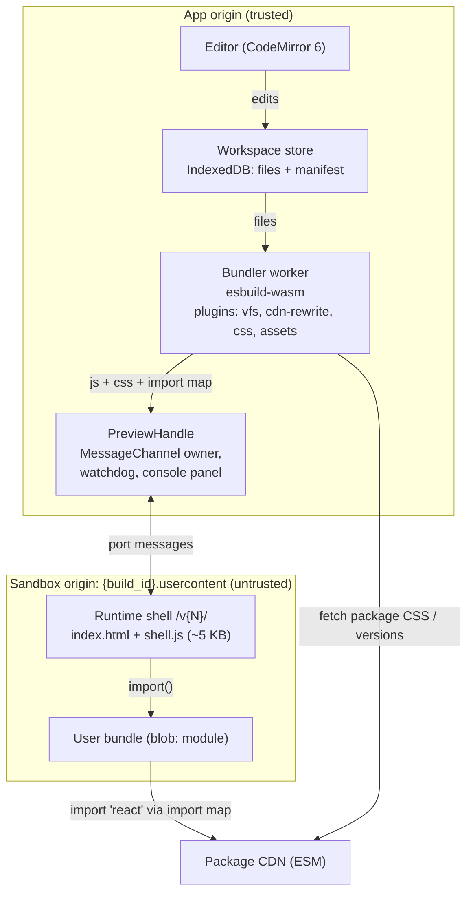
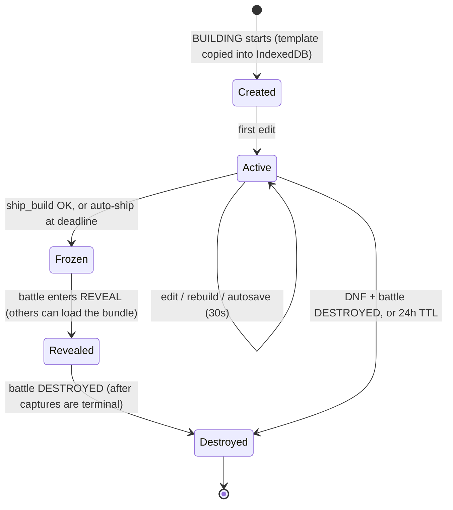

# 3. Disposable sandbox architecture

## 3.1 Requirements

**v1 must support:** React, TypeScript/TSX, CSS (plain, modules and package CSS), browser
APIs (Canvas, SVG, WebAudio, WebGL, `localStorage`, `fetch` to public APIs without keys),
frontend npm packages, and a live preview that updates in under a second.

**Out of scope for v1:** backend servers, Docker, a shell, databases, secrets, native
binaries, Node built-ins.

**Non-functional:** zero setup. Cold start under 3 s after the lobby preload. Rebuild
under 300 ms. Safe for *viewers* as well as builders. Every copy is destroyable.

## 3.2 Runtime choice

| Option | Pros | Cons | Verdict |
|---|---|---|---|
| **WebContainers** | Real Node, `npm install`, Vite and dev servers. Could support backends later. | Commercial license required for for-profit production use. Requires COOP/COEP cross-origin isolation, which constrains the whole app (third-party embeds, OAuth popups). Heavier boot and memory. Limited Safari/mobile support. Overkill when we have no backend. | Not for v1. Keep for a later "full-stack mode". |
| **Sandpack (hosted)** | Very fast to integrate, mature | Preview and bundler on a third-party origin, so we have less control over capture mode, storage wipe, heartbeat and package policy. Vendor dependency for a core feature. | Acceptable for a throwaway prototype only |
| **Custom: esbuild-wasm + ESM CDN + cross-site iframe** | Light, no license, works in every modern browser, full control of security and capture, no isolation headers needed | We have to build and maintain it, about 1.5k–3k lines | **Chosen** |

We hide the choice behind an interface so WebContainers (or anything else) can be added
later without touching game code:

```ts
interface SandboxRuntime {
  readonly kind: 'esm-browser' | 'webcontainer';
  boot(opts: { template: TemplateId; files?: FileMap }): Promise<void>;
  writeFile(path: string, contents: string): void;      // triggers debounced rebuild
  build(mode: 'dev' | 'production'): Promise<BuildResult>; // { js, css, manifest, diagnostics }
  attachPreview(frame: HTMLIFrameElement, buildId: string): PreviewHandle;
  exportSnapshot(): Promise<WorkspaceSnapshot>;          // source.json for ship/autosave
  destroy(): Promise<void>;                              // wipe IndexedDB + terminate worker
}
```

## 3.3 Components



### Workspace model
```jsonc
// manifest (stored with the files)
{
  "template": "react-ts",
  "entry": "src/main.tsx",
  "dependencies": { "react": "18.3.1", "react-dom": "18.3.1", "zustand": "4.5.2" },
  "tailwind": false
}
```
- The file tree is limited to: 50 files, 1 MB total source, 256 KB per file. Text only.
  Small images are allowed as files of ≤200 KB each, imported as data URLs.
- Templates: `react-ts` (default), `react-tailwind`, `canvas-game`, `svg-art`, `vanilla-ts`.
- Dependencies are added by typing an import (auto-detected, with an "Add `zustand`?"
  chip) or through a package search box. Versions are resolved once and pinned in the
  manifest, which makes the build reproducible for capture and reveal.
- **Paste-import:** paste a single big blob from an AI chat with
  `// file: src/App.tsx` markers and it becomes multiple files. This matters a lot for
  vibe coders.

## 3.4 Build pipeline

1. **Edit**, debounced by 150 ms, then the worker gets `{files, manifest}`.
2. esbuild-wasm runs `build()` with `format: 'esm'`, `bundle: true`, `jsx: 'automatic'`,
   `define: { 'process.env.NODE_ENV': '"development"' }`. In production mode it also
   minifies.
3. Plugins:
   - **`vfs`** resolves relative imports against the in-memory file map.
   - **`cdn-rewrite`** marks bare imports (`zustand`, `three/examples/jsm/...`) as
     `external` and rewrites them to `https://pkg.<cdn>/zustand@4.5.2?external=react,react-dom`
     (subpaths are kept). React itself stays bare and is resolved by the shell's import map.
   - **`css`** bundles local CSS imports into `bundle.css`. Package CSS is fetched from the
     CDN, cached in the worker and inlined. CSS modules are supported through esbuild's
     `local-css` loader.
   - **`assets`** turns images into data URLs.
   - **`tailwind`** (optional template): the shell loads the Tailwind browser runtime, so
     there's no build step.
4. The output is `{ js, css, importMap, diagnostics }`. Diagnostics go to the editor
   gutter and problems panel.
5. TypeScript **type checking is not on the hot path**. esbuild strips types. An optional
   TS language-service worker (M6) adds squiggles without blocking the preview.

## 3.5 Preview isolation

```html
<iframe
  src="https://{build_id}.buildroulette-usercontent.net/v3/"
  sandbox="allow-scripts allow-same-origin allow-forms allow-modals allow-pointer-lock allow-popups"
  allow="autoplay; fullscreen; gamepad; clipboard-write"
  referrerpolicy="no-referrer"
  loading="eager">
</iframe>
```

- **Why `allow-same-origin` is safe here:** the iframe's origin is a *different site*
  from the app. Same-origin only gives the build its own origin, which `localStorage` and
  IndexedDB need. Without it the origin is opaque and `localStorage` throws. Do **not**
  add: `allow-top-navigation*`, `allow-popups-to-escape-sandbox`, `allow-downloads`.
- **Per-build subdomain** keeps builds from reading each other's `localStorage`.
- **Shell response headers:**
  - `Content-Security-Policy: default-src 'none'; script-src 'self' 'unsafe-inline' 'unsafe-eval' blob: https://pkg.<cdn> https://<tailwind-runtime-host>; style-src 'self' 'unsafe-inline' blob: https:; img-src * data: blob:; font-src * data:; media-src * data: blob:; connect-src https: wss:; worker-src blob:; frame-ancestors https://<app-domain>`
  - `connect-src https:` is a deliberate v1 choice so builds can call public APIs (for
    example PokéAPI or Open-Meteo). The sandbox holds no secrets, so there is nothing
    of ours to exfiltrate.
  - `frame-ancestors` blocks other sites from embedding our sandbox shell.
  - `Permissions-Policy: camera=(), microphone=(), geolocation=(), payment=(), usb=(), serial=(), hid=()`
  - `Cross-Origin-Resource-Policy: same-site`, `Referrer-Policy: no-referrer`
  - **Why `'unsafe-eval'`** (T-006/T-007): libraries such as pixi.js v8 compile code with
    `new Function` at runtime. A build is arbitrary JavaScript already, so allowing eval
    doesn't widen what a build can do. Compatibility went from 52/55 to 54/55.
  - **Why `'unsafe-inline'` in `script-src`** (found in T-003): Chromium applies
    `script-src` to inline `<script type="importmap">`. The import map depends on each
    build's pinned React version, so a static host can't use a hash or a nonce. This
    doesn't widen what a build can do, because a build is arbitrary JavaScript loaded
    from `blob:` already.
- **Fresh document per load** (T-003): each `load` creates a new same-origin child iframe
  inside the shell (`document.write` of a standards-mode skeleton, then the import map,
  styles and a `blob:` module). Removing the old frame kills every timer and global the
  previous build left behind. `document.open()` on the shell's own page doesn't, because it
  keeps the same window.
- **Shell versioning:** the shell lives at immutable paths (`/v3/`). The protocol version
  is negotiated in the handshake.

### Bridge protocol (packages/protocol)
1. The shell loads and posts `{type: 'hello', protocol: 3}` to `parent` with target origin
   = app origin.
2. The app checks `event.origin` against `https://{build_id}.<usercontent>` and checks that
   `event.source` is that exact iframe's `contentWindow`. It then transfers a
   `MessageChannel` port along with a random nonce. From then on all traffic uses the port.

| Direction | Message | Purpose |
|---|---|---|
| app → shell | `load {js, css, importMap, mode: 'live'|'reveal'|'capture'}` | Run a bundle (the shell does a full document reset, then a fresh `import()` of a blob URL) |
| app → shell | `reset-storage` | Wipe `localStorage`, `sessionStorage`, IndexedDB and caches for this origin |
| app → shell | `capture-thumbnail {width, height}` | Best-effort client thumbnail |
| app → shell | `ping` | Watchdog probe |
| shell → app | `ready`, `heartbeat` | Liveness and capture readiness |
| shell → app | `console {level, args}` (throttled, size-capped) | Console panel |
| shell → app | `runtime-error {message, stack}` | Error overlay; maps back to source with sourcemaps |
| shell → app | `thumbnail {webp}` | Fallback screenshot |

Every message is validated with zod on receipt. Unknown or invalid messages are dropped.

### Hot reload
For v1, every rebuild does a **full reload of the iframe document**: the shell clears the
document and imports the new blob. This is simple and robust, and `localStorage`
persists across reloads within a build. React Fast Refresh is a possible later
enhancement.

### Watchdog
The shell sends a heartbeat every 1 s from the main thread. If heartbeats stop for 5 s
(for example because of an infinite loop), the PreviewHandle removes the iframe, shows
"Build froze", and offers "Restart preview". When building, the player's own preview
also gets a **safe-mode restart**: the next load runs with `requestAnimationFrame` and
timers paused until the user clicks, so a loop that runs on load can't freeze the page
repeatedly.

## 3.6 Workspace lifecycle



| Copy | Location | Created | Destroyed by |
|---|---|---|---|
| Working files | Builder's IndexedDB (app origin) | BUILDING start | Client on `battle.destroyed`, or on next app load (stale-workspace cleanup by battle id) |
| Autosave (source + last good bundle) | `ephemeral-builds/{battle}/{uid}/autosave/` | Every 30 s | destroy-worker prefix delete, TTL sweep |
| Shipped artifacts | `ephemeral-builds/{battle}/{uid}/{source.json, bundle.js, bundle.css, thumb.webp}` | Ship | destroy-worker prefix delete, TTL sweep |
| In-memory bundle | Viewers' tabs during reveal | REVEAL | Tab navigation, `battle.destroyed` message |
| Sandbox-origin storage | Each viewer's `{build_id}.usercontent` origin | When the build runs | `reset-storage` on every fresh load and on destroy |
| Capture session | Browser Rendering | Capture job | Session closed after each capture |

**Persisted forever:** only the screenshot WebP plus rows in Postgres (challenge, builder,
name, completion time, stats, awards, rank). The `stats` column holds non-code facts such
as `{files, lines, deps: ["zustand","three"], bundle_bytes, rebuilds}`, so results can say
"made with three.js" without keeping any code.

## 3.7 Capture mode

Browser Rendering opens
`https://{build_id}.usercontent/v3/?mode=capture&src=<signed-url>&sig=<hmac>`.
In capture mode, the shell:
- runs only when the `sig` is valid (an HMAC from the capture-worker, so random people
  can't use capture mode to render arbitrary URLs);
- fetches the bundle from the signed URL, which is short-lived and uncached;
- does not seed or stub `Math.random` or timers, so builds are captured as they really
  behave. Fonts are preloaded and the viewport is 1280×800 at DPR 1;
- reports `ready` on `window.buildRoulette.ready()`, or on network idle + 2 s (6 s cap).

The capture-worker then takes a PNG, converts it to WebP and stores it. Thumbnails come
from Supabase image transformations at read time.

## 3.8 Performance budgets

| Metric | Budget |
|---|---|
| esbuild-wasm + shell + React template preloaded during the lobby | Before the spin ends |
| First preview after BUILDING starts | < 1 s (preloaded), < 3 s cold |
| Rebuild + preview refresh (10 files) | < 300 ms p50, < 800 ms p95 |
| Ship (bundle + upload + RPC) | < 3 s p95 |
| Reveal: switch spotlight to next build | < 1 s (prefetch the next bundle) |

## 3.9 Threat model

| Threat | Vector | Mitigation |
|---|---|---|
| Steal viewer's session | Build reads app cookies or storage | Different registrable domain. The JWT never enters the sandbox, and the app never sends it over the port. |
| Tamper with app UI | Build accesses `parent.document` | Cross-origin, so the browser blocks it |
| Fake app messages | Build posts `ship` or `vote` messages to parent | The app doesn't take actions from shell messages. They are display-only (console, errors, liveness). Port and nonce checks plus schema validation. |
| Read other builds' data | Shared `localStorage` | Per-build subdomain plus a wipe on every load |
| Phishing | Fake "log in" form during reveal | App chrome labels the frame as a user build. Players have no password to type (anonymous/OAuth). Report button. |
| Navigate the viewer away | `top.location = ...` | No `allow-top-navigation` |
| Popup spam | `window.open` loops | Popups stay sandboxed (no escape). Browser popup blocking requires user activation. |
| Freeze or crash tab | Infinite loop, memory bomb | Heartbeat watchdog, one live iframe at a time, Chromium site isolation on desktop |
| Crypto mining | Long-running CPU | Only the spotlighted build runs. Reveal slots are time-boxed. Report button. |
| Hardware access | Camera, mic, geolocation, USB | Permissions-Policy plus `allow=` denylist |
| Abuse capture mode | Use our renderer as an open proxy | HMAC-signed capture URLs. The capture-worker only renders our own shell. |
| Exfiltrate our secrets | Sandbox calls our APIs | The sandbox has no credentials. Supabase RLS denies the anonymous key on everything relevant. |
| Malicious npm package | Supply-chain code in a dependency | Same isolation as user code. A CDN denylist for known-bad packages. Pinned versions. |
| Embed the shell elsewhere | Third-party site frames our shell | `frame-ancestors` is limited to the app origin |

### Review findings (T-008, code review; fixes tracked as T-009/T-010)

**Design rule: treat the shell as hostile.** The build's frame is same-origin with the
shell, so a build can run code in the shell's realm, use its port, and start a new
handshake. Every message from the sandbox is therefore *display-only and untrusted*:
console, errors, `ready`, `heartbeat` and `storage-reset`. Nothing that matters may
depend on them. In particular:
- capture readiness (M2) is decided by the capture worker, with a fixed wait and a cap.
  A shell `ready` is only a hint;
- destroy never relies on a `storage-reset` acknowledgement;
- once connected, the app ignores a repeated `hello` unless it started the reload itself.

| Threat | Vector | Mitigation |
|---|---|---|
| Builds are same-site with each other | `{build_id}.usercontent` subdomains share a registrable domain, so `Domain=` cookies are shared, a "cookie bomb" can break every preview, and `document.domain` works in some browsers | Add the usercontent apex to the **Public Suffix List** before launch (needs the domain; blocked on the user). Send `Origin-Agent-Cluster: ?1`. |
| Shell-realm persistence | The build installs timers or prototype patches on `parent`, which survive a frame teardown | A real restart recreates the whole preview iframe (new `PreviewHandle`). In production every build has its own shell iframe anyway. |
| App-side flood through the bridge | A hijacked port sends unlimited console messages and the app re-renders on each | Rate-limit and cap in `PreviewHandle`; batch UI updates per animation frame |
| Watchdog spoofing | The port is moved to a worker that keeps sending heartbeats while the main thread loops | Liveness pings must be answered from the main thread. Inherently best-effort; the app stays responsive thanks to site isolation. |
| Incomplete storage wipe | Cookies with other paths or domains, OPFS, Storage Buckets | Use `Clear-Site-Data` from a shell endpoint, plus OPFS and bucket removal |
| Popups outlive the build | `allow-popups` windows keep running and can phish outside the app chrome | No `allow-popups` and no `clipboard-write` in `reveal`/`capture` modes. They are allowed only while building your own app. |
| Headers on other paths | 404s or other paths on the sandbox host have no CSP | Apply the headers to every path. Add `base-uri 'none'`, `form-action` and a fuller Permissions-Policy. |
| Package CDN availability | Big packuments or tarballs, parallel downloads, a disk cache that never evicts | Global limits on downloads and extraction, streaming extraction, a disk quota/LRU, edge rate limits |

