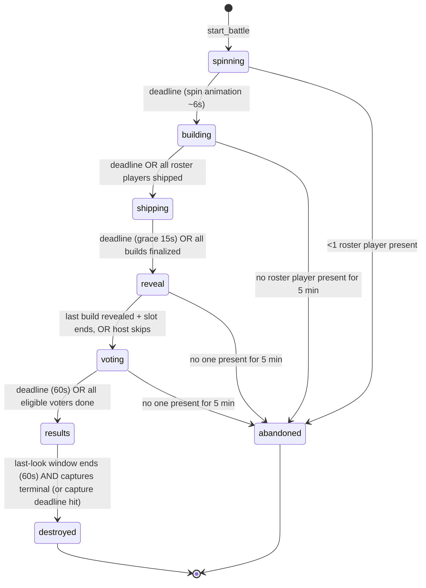
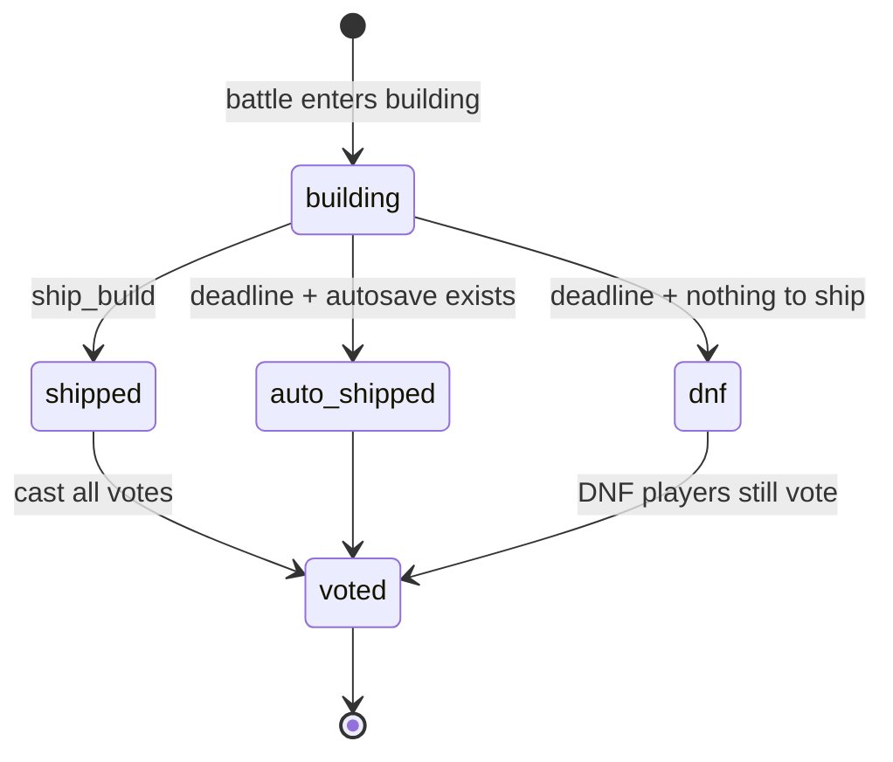

# 4. Multiplayer state machine

## 4.1 Entities

- **Room**: a persistent lobby reached by a 5-character code (`K7QXM`). A room hosts many
  battles (rematches) one after another.
- **Battle**: one round, from SPIN to DESTROY. It has a frozen roster, one challenge and
  one build per player. Its results are permanent.
- **Room member**: a person in the room (online or not), who is either a player or a spectator.
- **Battle player**: a member on the battle's roster, frozen when the battle starts.
  Only roster players build and vote.
- **Build**: a player's entry in a battle.

Postgres decides every state. Clients only send intents through RPCs.

## 4.2 Room states

```mermaid
stateDiagram-v2
  [*] --> open: create_room
  open --> in_battle: start_battle (host, ≥2 ready players)
  in_battle --> open: battle reaches destroyed / abandoned
  open --> closed: idle > 2h or host closes
  in_battle --> closed: (never directly; battle must finish or be abandoned first)
  closed --> [*]
```



## 4.3 Battle phases



DESTROYED and ABANDONED are terminal. Both trigger the destroy job. An abandoned battle
keeps whatever results exist, marked incomplete.

### Transition table

`advance_battle` implements this table and nothing else implements it. "Deadline" means
`now() >= phase_ends_at`.

| From | To | Trigger | Guard | Side effects (same transaction) |
|---|---|---|---|---|
| — | `spinning` | `start_battle(room_id, opts)` by host | Room `open`. ≥2 roster players ready (≥1 in solo mode). Caller is host. | Pick cards (weighted random, avoiding the room's recent cards). Insert `challenges`. Freeze roster into `battle_players`. Create a `draft` build per roster player. `phase_ends_at = now()+6s`. Room → `in_battle`. |
| `spinning` | `building` | Deadline | — | `building_started_at = now()`, `building_ends_at = now() + time_limit`, `phase_ends_at = building_ends_at` |
| `building` | `shipping` | Deadline **or** every non-left roster player has a non-draft build | — | `phase_ends_at = now()+15s`. If entered early (everyone shipped), the grace is 0 s and the battle goes straight to `reveal`. |
| `shipping` | `reveal` | Deadline **or** every build is final | — | Remaining `draft` builds: if an autosaved bundle exists, mark `auto_shipped` with `shipped_at = building_ends_at`, otherwise `dnf`. Compute `reveal_order` (random shuffle of shipped builds). `reveal_index = 0`. `phase_ends_at = now() + reveal_slot`. Enqueue a capture job per shipped build. |
| `reveal` | `reveal` (next slot) | Slot deadline **or** host `reveal_next` | `reveal_index < len-1` | `reveal_index++`, new slot deadline |
| `reveal` | `voting` | Last slot deadline **or** host `skip_to_vote` | — | `phase_ends_at = now()+60s` (configurable) |
| `voting` | `results` | Deadline **or** every eligible voter has voted in every category | — | Tally votes, write `awards`, set `builds.final_rank` and `total_votes`, compute auto-awards (Fastest Ship, Clutch Ship = shipped in the last 10 s). `finished_at = now()`. `phase_ends_at = now()+60s` (last look). |
| `results` | `destroyed` | Deadline **and** (all captures terminal **or** `now() > shipping_ended_at + 10 min`) | — | Enqueue destroy job. `destroyed_at` is set later by the destroy-worker. Room → `open` (rematch possible immediately). |
| any non-terminal | `abandoned` | Sweeper presence check | See diagram | Same as destroyed. Results stay partial. |

**No backwards transitions, ever.** A rematch is a new battle row.

### Phase durations (defaults, configurable per room)

| Phase | Duration |
|---|---|
| spinning | 6 s |
| building | 3 / 5 / 10 / 15 / 20 / 30 min (comes from the TIME LIMIT card or a room setting) |
| shipping | 15 s grace |
| reveal | 30–60 s per build (scaled by player count: `clamp(300s / n, 30s, 60s)`) |
| voting | 60 s |
| results (last look) | 60 s, then DESTROY. The results page stays forever. |

## 4.4 Player and build states

### Room member (presence-derived plus persisted)
`joined → ready ⇄ not_ready`. Leaving doesn't remove the row: `left_at` is set and the
player can rejoin. A kicked member is blocked from rejoining the room.

### Battle player

Connectivity (`online`/`offline`) is a separate dimension that comes **only from
Presence** and never blocks the state machine, except for the abandonment check.

### Build
- `status`: `draft → shipped | auto_shipped | dnf`, plus `disqualified` (by host or
  moderation; hidden from reveal and results).
- `capture_status`: `pending → captured | fallback | failed`
- `source_status`: `live → destroyed`

**Ship is final.** There is no unship, which keeps completion time meaningful and adds
tension. The UI asks "Ship it? You can't edit after." with the build name input.

## 4.5 Time and deadlines

- The server stores absolute timestamps (`phase_started_at`, `phase_ends_at`). Clients
  never send durations or times that matter.
- **Clock offset:** on connect and every 60 s, the client calls `server_now()` three
  times and keeps the sample with the lowest RTT:
  `offset = server_time + rtt/2 - local_time`. The countdown is
  `phase_ends_at - (Date.now() + offset)`.
- **Who advances on a deadline?**
  1. **Client nudge:** when a client's countdown reaches 0, it calls
     `advance_battle(id, expected_version)` after a random 0–500 ms jitter. Every client
     can do this. The first one wins and the rest get `{changed: false}`.
  2. **pg_cron backstop:** `sweep_deadlines()` runs every few seconds and advances
     overdue battles. This covers the case where all clients are asleep or offline.
  3. **Event-driven early advance:** `ship_build` and `cast_vote` call the same internal
     `try_advance()` at the end of their transaction (for example when the last player
     ships).
- **Deadline enforcement:** RPC guards use `now()`. Storage upload policies use the same
  rule. `ship_build` is accepted while `now() <= building_ends_at + shipping_grace`.
  `completion_ms = least(shipped_at, building_ends_at) - building_started_at`.

## 4.6 Concurrency rules

- Every mutating RPC locks the battle row with `SELECT … FOR UPDATE`, checks guards,
  writes, bumps `battles.version`, appends to `battle_events`, and broadcasts. All in one
  transaction.
- `advance_battle(expected_version)` is compare-and-set. A stale version is a no-op, not
  an error.
- Votes use the primary key `(battle_id, voter_id, category)` with
  `ON CONFLICT DO UPDATE`, so a player can change their vote until VOTING ends.
- Ships use the unique `(battle_id, builder_id)` constraint and `status = 'draft'` as
  the guard, so a double-click is harmless.
- Clients ignore any broadcast whose `version` ≤ their current version. A gap (received
  `version > current + 1`) means refetch the snapshot.

## 4.7 Realtime protocol

**Channel:** `battle:{battle_id}` (private; Realtime authorization through RLS on
`realtime.messages` that checks battle membership). Lobby state uses `room:{room_id}`.

**Broadcast events** (sent from Postgres triggers and kept small):

| Event | Payload |
|---|---|
| `phase` | `{version, phase, phase_ends_at, reveal_index?}` |
| `player` | `{version, user_id, status}` |
| `build` | `{version, build_id, status, name?}` |
| `vote_progress` | `{version, voted_count, eligible_count}` (never who voted for what) |
| `capture` | `{build_id, capture_status}` |
| `destroyed` | `{version}`, which tells clients to wipe local copies |

**Presence state** per client: `{user_id, display_name, device: 'desktop'|'mobile', activity: {lines, last_build: 'ok'|'error', typing: bool}}`.
It is throttled to at most one update every 2 s. This powers the "everyone's
progress" sidebar during BUILDING without any database writes.

**Client sync loop**
```ts
async function sync() {
  const snap = await rpc('get_battle_snapshot', { battle_id }); // battle + players + builds (+ challenge)
  store.replace(snap);                       // version = snap.battle.version
}
channel
  .on('broadcast', { event: '*' }, ({ payload }) => {
    if (payload.version <= store.version) return;          // stale
    if (payload.version > store.version + 1) return sync(); // gap → refetch
    store.apply(payload);
  })
  .on('presence', { event: 'sync' }, () => store.setPresence(channel.presenceState()))
  .subscribe(status => { if (status === 'SUBSCRIBED') sync(); }); // (re)connect → refetch
document.addEventListener('visibilitychange', () => document.visibilityState === 'visible' && sync());
```

## 4.8 Failure and reconnect scenarios

| Scenario | Behavior |
|---|---|
| Player refreshes during BUILDING | Workspace reloads from IndexedDB, snapshot refetched, countdown resumes. No loss. |
| Player's laptop dies during BUILDING | They can rejoin on another device. The workspace is restored from the remote autosave (≤30 s old). If they don't return, auto-ship uses the last autosaved bundle at the deadline. |
| Player offline at T-0 | The client can't auto-ship. At `shipping → reveal`, the server auto-ships the last autosaved bundle (`auto_shipped`), otherwise `dnf`. |
| Ship upload in flight at T-0 | The 15 s SHIPPING grace accepts it. `completion_ms` is capped at the time limit. |
| Host leaves mid-battle | Deadlines drive everything, so nothing blocks. Host powers (skip, kick, reveal_next) move to the longest-present roster player after 30 s of host absence. |
| Everyone leaves | The sweeper marks the battle `abandoned` after 5 min with no presence. Destroy still runs. |
| Two clients nudge at once | Compare-and-set: one advances, the other gets a no-op |
| Realtime disconnect | supabase-js reconnects. On `SUBSCRIBED` the client resyncs from the snapshot. |
| Late joiner during battle | Becomes a spectator. Watches presence and reveal. Not on the roster, so can't build or vote. |
| Clock skew of minutes | Irrelevant to correctness: the server decides. The UI is accurate after offset correction. |
| Malicious client calls RPCs out of order | Guards reject it. Clients can't write any table directly. |

## 4.9 Voting rules

- Default categories: **Best Build** (overall), **Best Use of the Rule**, **Best Style**,
  **Most Chaotic**. Each eligible voter gets one vote per category.
- Eligible voters are roster players (including DNF). No self-votes. Votes for DNF or
  disqualified builds are not possible.
- Ranking order: votes in Best Build, then total votes across categories, then earlier
  `shipped_at`.
- Award ties are shared (several `awards` rows).
- Individual ballots are never exposed to clients, only tallies after RESULTS.
- Solo or 1-player battles skip VOTING and get auto-awards only.
