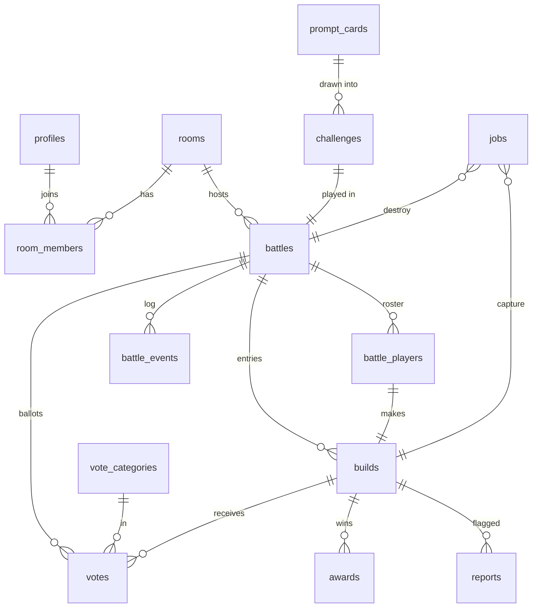

# 5. Database schema

Postgres on Supabase. The **permanent** data is the challenge, builder, build name,
completion time, screenshot path, awards and battle results. Source code and bundles are
**never** stored in Postgres. They live only in the ephemeral Storage bucket.

## 5.1 Entity overview



## 5.2 DDL (draft)

```sql
-- ─── Enums ────────────────────────────────────────────────────────────────
create type card_kind      as enum ('build', 'rule', 'style');
create type room_status    as enum ('open', 'in_battle', 'closed');
create type member_role    as enum ('player', 'spectator');
create type battle_phase   as enum ('spinning', 'building', 'shipping', 'reveal',
                                    'voting', 'results', 'destroyed', 'abandoned');
create type build_status   as enum ('draft', 'shipped', 'auto_shipped', 'dnf', 'disqualified');
create type capture_status as enum ('pending', 'captured', 'fallback', 'failed');
create type job_kind       as enum ('capture', 'destroy');
create type job_status     as enum ('queued', 'running', 'done', 'failed');

-- ─── People ───────────────────────────────────────────────────────────────
create table profiles (
  id            uuid primary key references auth.users (id) on delete cascade,
  display_name  text not null check (char_length(display_name) between 1 and 24),
  avatar_seed   text not null default encode(gen_random_bytes(6), 'hex'),
  created_at    timestamptz not null default now()
);

-- ─── Challenge deck ───────────────────────────────────────────────────────
create table prompt_cards (
  id         uuid primary key default gen_random_uuid(),
  kind       card_kind not null,
  text       text not null,                 -- "A pomodoro timer"
  hint       text,                          -- optional clarification
  weight     int  not null default 10 check (weight > 0),
  tags       text[] not null default '{}',  -- e.g. {'canvas','audio'} to avoid impossible combos
  is_active  boolean not null default true,
  created_at timestamptz not null default now()
);

create table challenges (
  id                 uuid primary key default gen_random_uuid(),
  build_card_id      uuid references prompt_cards (id),
  rule_card_id       uuid references prompt_cards (id),
  style_card_id      uuid references prompt_cards (id),
  -- text snapshots: editing a card later never rewrites history
  build_text         text not null,
  rule_text          text not null,
  style_text         text not null,
  time_limit_seconds int  not null check (time_limit_seconds between 60 and 3600),
  created_at         timestamptz not null default now()
);

-- ─── Rooms (transient lobby, kept small) ──────────────────────────────────
create table rooms (
  id                uuid primary key default gen_random_uuid(),
  code              text not null unique check (code ~ '^[A-HJ-NP-Z2-9]{5}$'), -- no I/O/0/1
  host_id           uuid not null references profiles (id),
  status            room_status not null default 'open',
  settings          jsonb not null default '{}',  -- max_players, allowed_time_limits, reveal_slot_s, vote_s, categories[]
  current_battle_id uuid,                         -- fk added below
  created_at        timestamptz not null default now(),
  last_activity_at  timestamptz not null default now(),
  closed_at         timestamptz
);

create table room_members (
  room_id    uuid not null references rooms (id) on delete cascade,
  user_id    uuid not null references profiles (id),
  role       member_role not null default 'player',
  is_ready   boolean not null default false,
  joined_at  timestamptz not null default now(),
  last_seen_at timestamptz not null default now(), -- heartbeat RPC; used by abandonment sweep
  left_at    timestamptz,
  kicked_at  timestamptz,
  primary key (room_id, user_id)
);

-- ─── Battles (permanent) ──────────────────────────────────────────────────
create table battles (
  id                  uuid primary key default gen_random_uuid(),
  room_id             uuid references rooms (id) on delete set null,  -- results outlive rooms
  challenge_id        uuid not null references challenges (id),
  host_id             uuid not null references profiles (id),
  phase               battle_phase not null default 'spinning',
  version             int not null default 0,
  phase_started_at    timestamptz not null default now(),
  phase_ends_at       timestamptz,
  settings            jsonb not null,               -- snapshot of room settings at start
  building_started_at timestamptz,
  building_ends_at    timestamptz,
  shipping_ended_at   timestamptz,
  reveal_order        uuid[] not null default '{}', -- build ids
  reveal_index        int not null default 0,
  finished_at         timestamptz,                  -- results computed
  destroyed_at        timestamptz,                  -- ephemeral data confirmed deleted
  is_complete         boolean not null default false, -- false for abandoned
  created_at          timestamptz not null default now()
);
alter table rooms add constraint rooms_current_battle_fk
  foreign key (current_battle_id) references battles (id) on delete set null;

create index battles_active_deadline_idx on battles (phase_ends_at)
  where phase not in ('destroyed', 'abandoned');
create index battles_room_idx on battles (room_id, created_at desc);

create table battle_players (
  battle_id      uuid not null references battles (id) on delete cascade,
  user_id        uuid not null references profiles (id),
  display_name   text not null,        -- snapshot for permanent results
  is_voter       boolean not null default true,
  voted_at       timestamptz,          -- set when all categories are cast
  primary key (battle_id, user_id)
);

-- ─── Builds (permanent metadata only) ─────────────────────────────────────
create table builds (
  id                  uuid primary key default gen_random_uuid(),
  battle_id           uuid not null references battles (id) on delete cascade,
  builder_id          uuid not null references profiles (id),
  name                text check (char_length(name) between 1 and 48),
  status              build_status not null default 'draft',
  shipped_at          timestamptz,
  completion_ms       int check (completion_ms >= 0),
  stats               jsonb not null default '{}',   -- {files, lines, deps[], bundle_bytes, rebuilds, pastes}
  capture_status      capture_status not null default 'pending',
  screenshot_path     text,                          -- screenshots/{battle_id}/{id}.webp
  captured_at         timestamptz,
  source_destroyed_at timestamptz,
  final_rank          int,
  total_votes         int not null default 0,
  created_at          timestamptz not null default now(),
  unique (battle_id, builder_id),
  foreign key (battle_id, builder_id) references battle_players (battle_id, user_id)
);
create index builds_builder_history_idx on builds (builder_id, created_at desc);

-- ─── Voting & awards ──────────────────────────────────────────────────────
create table vote_categories (
  slug        text primary key,           -- 'overall', 'rule', 'style', 'chaos'
  label       text not null,
  description text,
  sort_order  int not null default 0,
  is_active   boolean not null default true
);

create table votes (
  battle_id  uuid not null references battles (id) on delete cascade,
  voter_id   uuid not null,
  category   text not null references vote_categories (slug),
  build_id   uuid not null references builds (id) on delete cascade,
  created_at timestamptz not null default now(),
  updated_at timestamptz not null default now(),
  primary key (battle_id, voter_id, category),
  foreign key (battle_id, voter_id) references battle_players (battle_id, user_id)
);

create table awards (
  id         uuid primary key default gen_random_uuid(),
  battle_id  uuid not null references battles (id) on delete cascade,
  build_id   uuid not null references builds (id) on delete cascade,
  award      text not null,               -- category slug or auto award: 'fastest_ship', 'clutch_ship', 'winner'
  source     text not null check (source in ('vote', 'auto')),
  votes      int,
  created_at timestamptz not null default now(),
  unique (battle_id, award, build_id)     -- ties produce multiple rows
);

-- ─── Ops ──────────────────────────────────────────────────────────────────
create table battle_events (                -- append-only audit/debug log
  id         bigint generated always as identity primary key,
  battle_id  uuid not null references battles (id) on delete cascade,
  version    int not null,
  type       text not null,                 -- 'phase', 'ship', 'vote', 'kick', 'host_change', ...
  actor_id   uuid,                          -- null = system/cron
  payload    jsonb not null default '{}',
  created_at timestamptz not null default now()
);
create index battle_events_battle_idx on battle_events (battle_id, id);

create table jobs (                         -- tiny durable queue for capture/destroy workers
  id          bigint generated always as identity primary key,
  kind        job_kind not null,
  ref_id      uuid not null,                -- build_id (capture) or battle_id (destroy)
  status      job_status not null default 'queued',
  attempts    int not null default 0,
  run_after   timestamptz not null default now(),
  last_error  text,
  created_at  timestamptz not null default now(),
  updated_at  timestamptz not null default now(),
  unique (kind, ref_id)
);
create index jobs_ready_idx on jobs (run_after) where status in ('queued', 'running');

create table reports (
  id          uuid primary key default gen_random_uuid(),
  build_id    uuid not null references builds (id) on delete cascade,
  reporter_id uuid not null references profiles (id),
  reason      text not null check (reason in ('offensive', 'phishing', 'malware', 'spam', 'other')),
  details     text,
  status      text not null default 'open' check (status in ('open', 'actioned', 'dismissed')),
  created_at  timestamptz not null default now(),
  unique (build_id, reporter_id)
);
```

Notes:
- **What's permanent:** `challenges`, `battles`, `battle_players`, `builds`, `awards`,
  `votes` (kept for auditing; could be pruned to tallies after 30 days), and screenshots.
- **What's transient:** `rooms` and `room_members` (closed rooms are purged after 7 days,
  and battles keep `room_id = null`), `jobs` (pruned after 7 days), and `battle_events`
  (pruned after 30 days).
- `jobs` could be replaced by Supabase Queues (pgmq) later. A plain table is enough at v1
  volume and easy to inspect.

## 5.3 Row-level security

RLS is enabled on every table. **Clients get SELECT only. All writes go through RPCs.**

| Table | SELECT policy |
|---|---|
| `profiles` | Anyone authenticated (display name and avatar are public) |
| `prompt_cards` | Nobody. Draws happen server-side. |
| `challenges` | Visible if the linked battle is visible |
| `rooms`, `room_members` | Members of the room only. Joining by code goes through `join_room`, so codes can't be enumerated. |
| `battles`, `battle_players`, `builds` | Battle members (roster or room member at the time), **or** anyone once `phase in ('results','destroyed')` (public results pages) |
| `votes` | Own votes only |
| `awards` | Same as battles |
| `battle_events`, `jobs`, `reports` | Nobody (service role only), except that a reporter can see their own reports |

Helper: `is_battle_member(battle_id) returns boolean` (`security definer`, `stable`,
`set search_path = ''`) so policies stay cheap and aren't recursive.

## 5.4 RPC surface

Every function is `security definer` with `set search_path = ''`. Each one validates
`auth.uid()`, locks the battle or room row, checks guards, bumps `version`, writes
`battle_events` and returns the new state.

| RPC | Caller | Notes |
|---|---|---|
| `server_now() → timestamptz` | any | Clock-offset sampling |
| `create_room(display_name, settings) → {room_id, code}` | any | Upserts the profile and generates a unique code (retries on collision) |
| `join_room(code, display_name) → room_id` | any | Rejects kicked users and full rooms. Joins as a spectator if a battle is running. |
| `leave_room(room_id)` | member | |
| `set_ready(room_id, ready)` | member | |
| `update_room_settings(room_id, settings)` | host | Only while `open` |
| `kick_member(room_id, user_id)` | host | Disqualifies their draft build if a battle is active |
| `start_battle(room_id, opts) → battle_id` | host | See transition table in [04](04-state-machine.md#43-battle-phases) |
| `advance_battle(battle_id, expected_version) → {changed, version}` | any member, cron | The **only** transition function. It's idempotent. |
| `reveal_next(battle_id, expected_version)` / `skip_to_vote(...)` | host | |
| `ship_build(battle_id, name, stats) → build` | roster player | Checks phase, deadline + grace and that `source.json` + `bundle.js` exist in `storage.objects` under the player's prefix. Stamps `shipped_at = now()`. |
| `cast_vote(battle_id, category, build_id)` | eligible voter | No self-votes, only shipped builds, `voting` phase only. Upsert. |
| `get_battle_snapshot(battle_id) → jsonb` | member / public after results | One round trip for the client sync loop |
| `report_build(build_id, reason, details)` | authenticated | Rate-limited |
| internal `try_advance(battle_id)` | ship/vote RPCs | Early transitions |
| internal `finalize_results(battle_id)` | `advance_battle` | Tally, awards, ranks |
| cron `sweep_deadlines()` | pg_cron, every few seconds | `advance_battle` for overdue rows |
| cron `sweep_jobs()` | pg_cron, every 30 s | Re-dispatches stuck or failed jobs via `pg_net` (max 5 attempts, exponential backoff) |
| cron `sweep_ttl()` | pg_cron, every 10 min | Enqueues destroy for battles older than 24 h with `destroyed_at is null`, and abandons battles with no presence |
| service `claim_job(kind) / complete_job(id, result)` | Edge Functions | `FOR UPDATE SKIP LOCKED` |
| service `complete_capture(build_id, status, path)` | capture-worker | |
| service `complete_destroy(battle_id)` | destroy-worker | Sets `builds.source_destroyed_at` and `battles.destroyed_at` |

Presence for the abandonment check: the server can't read Realtime presence directly, so
clients call a cheap `heartbeat(battle_id)` RPC every 60 s, which updates
`room_members.last_seen_at`. The sweeper uses that timestamp.

## 5.5 Storage buckets and policies

| Bucket | Public | Path | Written by | Read by | Lifetime |
|---|---|---|---|---|---|
| `ephemeral-builds` | no | `{battle_id}/{user_id}/source.json`, `bundle.js`, `bundle.css`, `thumb.webp`, `autosave/source.json`, `autosave/bundle.js` | The owner, via storage RLS | The owner any time. Battle members once `phase >= reveal`. Service role. | Until destroy (≤ ~1 h typical, 24 h hard TTL) |
| `screenshots` | yes (unguessable path) | `{battle_id}/{build_id}.webp` | Service role only | Everyone | Permanent (deleted on moderation takedown) |

Storage RLS for writes to `ephemeral-builds`, sketched:
```sql
create policy "player uploads own build while building"
on storage.objects for insert to authenticated
with check (
  bucket_id = 'ephemeral-builds'
  and (storage.foldername(name))[2] = auth.uid()::text
  and public.can_upload_build((storage.foldername(name))[1]::uuid)  -- phase in (building, shipping) and now() <= building_ends_at + grace and caller on roster and build is draft
);
-- matching UPDATE policy for upsert (autosave overwrites); no DELETE policy for clients
```
Size limits: the bucket `file_size_limit` is 5 MB and allowed MIME types are
`application/json`, `text/javascript`, `text/css` and `image/webp`.

**Deleting files:** the destroy-worker lists `{battle_id}/` and deletes through the
Storage API. Never `DELETE FROM storage.objects` directly, because that leaves the
underlying objects behind.

## 5.6 Retention summary

| Data | Kept |
|---|---|
| Challenge, battle, roster names, build name, completion time, stats, rank, awards | Forever |
| Screenshot WebP | Forever (unless taken down) |
| Votes (individual ballots) | 30 days, then optionally pruned (tallies remain on `builds.total_votes` and `awards`) |
| Source, bundles, autosaves, client thumbnails | Until DESTROY. Hard max 24 h. |
| Rooms and members | 7 days after close |
| Battle events, jobs | 30 / 7 days |
| Anonymous profiles with no battles | 30 days |

## 5.7 Implementation notes (T-011, M2 solo loop)

These are where the implementation differs from or adds to the drafts above. The
migrations in `supabase/migrations/` are the source of truth.

- **Schemas:** internal helpers live in a `private` schema that no API role can use. The
  first M2 migration also revokes the global default EXECUTE-to-PUBLIC on new functions.
- **Deck:** 60 BUILD, 40 RULE and 30 STYLE cards with hints and weights. Tags
  `needs:<cap>` / `no:<cap>` prevent impossible combinations. Challenges snapshot texts and
  hints.
- **Solo RPCs:** `start_solo_battle`, `advance_battle`, `ship_build`,
  `get_battle_snapshot`, `server_now`.
  - Each player can have only one running solo battle.
  - If no time limit is given, the server picks 5, 10 or 15 minutes.
  - Versions start at 1.
  - `advance_battle` applies every transition that is due in one call. For example, the
    last ship goes BUILDING → SHIPPING (no grace) → RESULTS.
  - Multiplayer branches raise `not_implemented` (SQLSTATE 0A000) until M3.
- **Error contract:** `message` is a stable snake_case code, `details` is human text.
  SQLSTATEs: 42501 auth/roster, P0002 not found (also used for battles you can't see),
  22023 bad input, P0001 guard failures, 0A000 not implemented.
- **Auto-awards (solo):**
  - `clutch_ship`: shipped by hand in the last 10 s or during the grace;
  - `speedrun`: shipped by hand using ≤ 50% of the time limit;
  - `fastest_ship`: only when at least 2 builds were shipped by hand.

  Auto-shipped builds get no awards.
- **Auto-ship:** needs both `autosave/bundle.js` and `autosave/source.json`; otherwise the
  build is a DNF. DNF builds get no capture job.
- **Storage:**
  - `ephemeral-builds`: 5 MB, json/js/css/webp. Only the 6 known file names under
    `{battle}/{uid}/` may be written, and only while the build is a draft, the phase allows
    it and the deadline + grace hasn't passed. Owners can read their own folder. No client
    deletes.
  - `screenshots`: public, webp/png, written only by the service role.
  - Deleting `storage.objects` rows from SQL is blocked by a trigger; workers must use the
    Storage API.
- **Jobs:** `claim_job` takes a 2-minute lease. Failures get up to 5 attempts with
  10/20/40/80 s backoff. There is no pg_net push yet; workers poll.
- **Sweeps (pg_cron):**
  - `sweep_deadlines` every 5 s, one subtransaction per battle with `skip locked`;
  - `sweep_ttl` every 10 min: past 24 h, a battle in RESULTS goes to DESTROYED, other
    phases go to ABANDONED, and failed destroy jobs are re-queued.
- **Tests:** the canonical DB tests run on the real local Supabase stack
  (`supabase test db`: 462 pgTAP tests, plus `supabase/scripts/e2e-solo.mjs`: 44 API checks).
  The plain-Postgres harness and shim were retired in T-011.
- **Not yet:** retention pruning (jobs after 7 days, events after 30), and a concurrency
  test for `SKIP LOCKED`.

